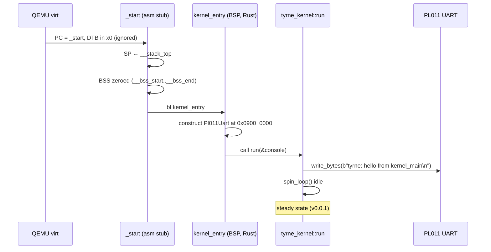

# Boot flow

Tyrne boots in four stages: QEMU (or the board firmware) hands control to the ELF entry point, a short assembly stub sets up the runtime environment, a Rust entry function (`kernel_entry`) wires the BSP together, and the portable `tyrne_kernel::run` function takes over. This document is the "how" for Phase 4c on `bsp-qemu-virt`; the "why" for each concrete choice lives in [ADR-0012](../decisions/0012-boot-flow-qemu-virt.md). Each future BSP will follow the same stage structure with its own addresses and peripherals.

## Context

The overall three-layer architecture is described in [`overview.md`](overview.md), and the HAL traits the kernel uses are in [`hal.md`](hal.md). This document focuses specifically on the boot path from reset to `kernel_main` steady state, as implemented for the QEMU `virt` aarch64 target.

## Design

### Stages

The four boot stages, each with a tightly bounded responsibility:

1. **Firmware / loader.** QEMU's `-kernel` flag loads the ELF image at its linked-in load address (`0x40080000` per [ADR-0012](../decisions/0012-boot-flow-qemu-virt.md)), sets the PC to the ELF's entry point (`_start`), and enters at EL1 or EL2 depending on machine configuration. The device-tree blob address is placed in `x0`; v1 ignores it.
2. **Assembly stub (`_start`).** ~20 instructions. Loads `__stack_top` into `SP`, zeroes the BSS range (`__bss_start` .. `__bss_end`) using 8-byte stores, and branches to `kernel_entry`. If `kernel_entry` ever returns (it shouldn't), the stub falls into a `wfe; b .` halt loop.
3. **`kernel_entry` (Rust, in the BSP).** The first Rust code to run. Constructs the BSP's concrete HAL instances (for Phase 4c: the `Pl011Uart` console), then calls the portable [`tyrne_kernel::run`](../../kernel/src/lib.rs) with the console handle. Marked `#[no_mangle] extern "C"` so the assembly stub can find it.
4. **`tyrne_kernel::run` (portable kernel).** Architecture- and board-agnostic. In Phase 4c v0.0.1 it writes a greeting to the console and halts with a `spin_loop` idle. Subsequent phases will bring up the scheduler, IPC, and capability system here before reaching steady state.

### Boot-time sequence



### Memory map at boot

The kernel image is a single contiguous block starting at `0x40080000`; RAM below that is reserved for QEMU's internal use. The initial stack is a 64 KiB region reserved at the image's tail.

```
0x4000_0000  ─── RAM start (reserved for QEMU firmware region)
             ...
0x4008_0000  ─── _start (.text.boot) ← ELF entry
             .text
             .rodata
             .data
             .bss              (zeroed by _start)
             [reserved 64 KiB] (initial stack region)
__stack_top  ─── high end of stack
             ...
0x4800_0000  ─── end of 128 MiB RAM region
```

- **Code and read-only data** (`.text`, `.rodata`) are loaded at their linked addresses.
- **Initialized data** (`.data`) is loaded from the ELF.
- **BSS** is zeroed in `_start` before Rust executes, so all `static` items in safe Rust see their declared initial values (zero for BSS-resident statics).
- **Stack** grows downward from `__stack_top`. Nothing enforces that it does not grow into `.bss` — stack overflow is undefined behaviour in v1. Guard pages arrive with MMU setup.

### What `_start` does, line-by-line

```asm
.section .text.boot, "ax"
.global _start
_start:
    adrp x0, __stack_top          ; page-aligned base of the symbol
    add  x0, x0, :lo12:__stack_top ; add the low 12 bits
    mov  sp, x0                    ; set SP

    adrp x0, __bss_start
    add  x0, x0, :lo12:__bss_start
    adrp x1, __bss_end
    add  x1, x1, :lo12:__bss_end
0:  cmp  x0, x1
    b.hs 1f
    str  xzr, [x0], #8
    b    0b

1:  bl   kernel_entry              ; hand off to Rust
2:  wfe                            ; defensive halt if we return
    b    2b
```

`adrp + add` with `:lo12:` is the standard aarch64 idiom for "address of symbol" — PC-relative, handles any static layout the linker picks. `str xzr, [x0], #8` stores the zero register with post-increment.

### Linker script responsibilities

[`bsp-qemu-virt/linker.ld`](../../bsp-qemu-virt/linker.ld) pins the above memory map:

- `ENTRY(_start)` — the ELF's `e_entry` is set to `_start`'s address.
- `MEMORY` — a single `RAM` region: `ORIGIN = 0x40080000, LENGTH = 128M`.
- `.text` starts with `KEEP(*(.text.boot))`, guaranteeing `_start` is at `0x40080000`.
- `.bss` is 8-byte aligned at both ends so the BSS-zero loop can step by 8.
- A 64 KiB stack region is reserved after `.bss`; `__stack_top` names its high end.
- `/DISCARD/` drops `.comment`, `.note.*`, `.eh_frame*`, and `.gcc_except_table*` — unwinding tables are dead weight under [`panic=abort`](../standards/error-handling.md).

### Panic path

When `tyrne_kernel::run` or any later kernel code panics, control reaches the BSP's `#[panic_handler]` function. In Phase 4c, that handler:

1. Reconstructs the `Pl011Uart` (the original instance may not be reachable from the panic context).
2. Writes a short marker (`"\n!! tyrne panic !!\n"`).
3. Writes the panic message using `FmtWriter` adapted onto the `Console`.
4. Halts in a `spin_loop` that never returns.

This is the minimum useful panic reporting. Future revisions will add core id, register state, and a backtrace — each requires additional infrastructure that is not in v1.

## Invariants

Properties the boot flow maintains. These are the claims a reader can rely on and a test can exercise.

- **Entry is deterministic.** `_start` always runs the same sequence of instructions on the same input.
- **The stack is set before any Rust code runs.** No Rust code executes with an undefined `SP`.
- **BSS is zero when Rust sees it.** All `static` items in safe Rust have their declared initial values.
- **`kernel_entry` never runs more than once.** There is only one boot CPU in v1; it calls `kernel_entry` once.
- **`kernel_entry` never returns to the asm stub.** It is `-> !`; a return would be a bug and is defensively halted by the stub.
- **Hardware MMIO addresses are hardcoded.** No runtime discovery. BSP-specific; justified because `virt` is a fixed platform.
- **`panic=abort`, not unwind.** No unwinding tables in the binary; panics halt.

## Trade-offs

- **No EL drop.** Running at whatever EL QEMU delivers means MMU and some system registers are not uniformly accessible. This is fine for Phase 4c (we do not touch them); it is the future work the MMU-bringup ADR will address.
- **DTB ignored.** Convenient now; will need explicit parsing when the first board with runtime topology (Pi 4) lands.
- **Stack is a fixed 64 KiB with no guard page.** Overflow is UB. Good enough for v1; per-task stacks with guards come with the scheduler.
- **`_start` is hand-written assembly.** Every BSP will have its own. A shared-boot library would force premature commonality; we accept the duplication to keep each BSP's boot transparent.
- **Hardcoded UART base.** `0x0900_0000` is QEMU `virt` specific. Each BSP carries its own constants; the trade is deliberate (see [P6 — HAL separation](../standards/architectural-principles.md#p6--hal-separation)).

## Open questions

- **Exception Level drop.** When the first EL1-specific primitive is needed.
- **DTB parsing and `BootInfo`.** The kernel's typed boot-info contract, probably introduced with Pi 4 support.
- **Multi-core start.** PSCI `CPU_ON` for secondary cores.
- **MMU activation at boot.** Currently MMU-off; the linker script may need adjustments when the kernel-half mapping is introduced.
- **Guard-page stacks.** Dependent on MMU activation.
- **Measured boot / attestation.** Hardware-dependent; deferred per [ADR-0012](../decisions/0012-boot-flow-qemu-virt.md).

## References

- [ADR-0012: Boot flow and memory layout for `bsp-qemu-virt`](../decisions/0012-boot-flow-qemu-virt.md).
- [ADR-0004: Target platforms](../decisions/0004-target-platforms.md).
- [ADR-0006: Workspace layout](../decisions/0006-workspace-layout.md).
- [`hal.md`](hal.md) — the HAL traits the BSP implements.
- [`overview.md`](overview.md) — three-layer architecture.
- [`docs/guides/run-under-qemu.md`](../guides/run-under-qemu.md) — how to actually run the kernel.
- QEMU `virt` machine documentation — https://qemu.readthedocs.io/en/latest/system/arm/virt.html
- ARM *Architecture Reference Manual* (ARMv8-A) — `adrp` / `ERET` / EL semantics.
- PL011 UART documentation — for the console implementation.
