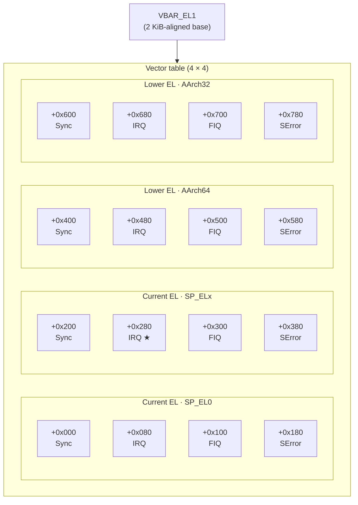
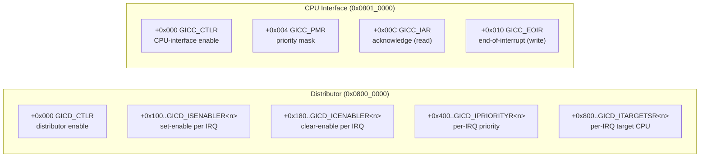

# Exception infrastructure and interrupt delivery

Tyrne's exception path is a 16-entry aarch64 vector table installed at `VBAR_EL1`, dispatching to one of four behaviours depending on the source class — synchronous exceptions (SVC, abort), IRQs (timer, GIC-routed device lines), FIQs (panic in v1), or SErrors (panic in v1). The IRQ path drives the GIC v2 controller on QEMU virt's `0x0800_0000` distributor + `0x0801_0000` CPU interface, acknowledging at entry, dispatching to a kernel handler, and signalling end-of-interrupt at exit. This document is the *how* for the design [T-012](../analysis/tasks/phase-b/T-012-exception-and-irq-infrastructure.md) implements; the *why* for each constituent ADR (HAL trait shape, EL drop policy, raw-pointer bridge interaction) lives in their respective ADRs.

> **Status (2026-04-28).** T-012 is `In Review` — this design doc was drafted first, ahead of the code, to satisfy the [B0 closure security review §8 recommendation](../analysis/reviews/security-reviews/2026-04-27-B0-closure.md) that architecture docs land *with* the code rather than as a follow-up. The implementation followed in three commits (`a043079` GIC + vector table, `b4ed68c` timer arm/cancel + irq_entry + idle WFI, `28c5ce9` documentation sweep). The implementation map below names which step landed in which commit. Maintainer-side QEMU smoke + Miri pass remain pending per the same disclaimer T-013 used.

## Context

Phase A and B0 shipped a kernel that does not handle interrupts: cooperative scheduling, `DAIF` masked from the reset vector onward (per ADR-0024 + the K3-12 boot-checklist rule), idle's body spin-yields because `wfi` would block forever without a wake source. T-013 closed the EL question — the kernel runs at EL1 unconditionally, with the BSP's reset stub doing the EL2→EL1 drop when needed. T-012 is the next step: a vector table at `VBAR_EL1`, a GIC driver, generic-timer IRQ wiring, and idle's `wfi` activation.

The constituent decisions are all already settled by Accepted ADRs:

- [ADR-0011 — `IrqController` HAL trait](../decisions/0011-irq-controller-trait.md) — four-method trait surface (`enable` / `disable` / `acknowledge` / `end_of_interrupt`) with `IrqNumber` newtype. The QEMU virt BSP gains a `QemuVirtGic` impl.
- [ADR-0010 — `Timer` HAL trait](../decisions/0010-timer-trait.md) — defines `arm_deadline(deadline_ns)` / `cancel_deadline()` whose IRQ-armed half is `unimplemented!()` until T-012 wires the generic-timer IRQ.
- [ADR-0021 — Raw-pointer scheduler IPC-bridge API](../decisions/0021-raw-pointer-scheduler-ipc-bridge.md) — the no-`&mut`-across-context-switch discipline. IRQ delivery while `ipc_send_and_yield` is mid-flight extends this discipline to the handler frame; ADR-0021 carries the [2026-04-28 Amendment](../decisions/0021-raw-pointer-scheduler-ipc-bridge.md#revision-notes) recording the extension.
- [ADR-0022 — Idle task and typed `SchedError::Deadlock`](../decisions/0022-idle-task-and-typed-scheduler-deadlock.md) — first rider's *Sub-rider* gates idle's `wfi` activation on T-012's IRQ infrastructure being live.
- [ADR-0024 — EL drop to EL1 policy](../decisions/0024-el-drop-policy.md) — establishes the EL1 + non-VHE invariant the vector table relies on. `VBAR_EL1` is the EL1 vector base; if the kernel were running at EL2 (which it cannot, post-T-013), it would write `VBAR_EL2` instead.

## Design

### Vector table at `VBAR_EL1`

aarch64 exception vectors are a 2 KiB-aligned table of 16 entries. Each entry is at most 32 instructions (0x80 bytes); the CPU branches to the entry for the relevant exception class on every taken exception. The table is installed by writing its base address to `VBAR_EL1` once at boot, before `DAIF.I` is unmasked.



`★` is the only entry that fires in v1. Tyrne runs at EL1 with `SPSel = 1` (per the EL drop's `SPSR_EL2 = 0x3c5` mode field, EL1h means EL1 + SP_EL1), so an IRQ taken from running kernel code lands at offset `+0x280`. The other 15 entries trampoline into a panic-class Rust handler that prints the source class and halts; v1 has no SVC handler (no userspace yet), no FIQ source, and no SError-recoverable scenario.

The table itself lives in a dedicated `.text.vectors` linker section; `linker.ld` aligns the section to a 2 KiB boundary so `VBAR_EL1` can address it directly. The asm trampolines are hand-written `naked_asm!`-style — the compiler does not generate prologue/epilogue code that would corrupt the saved register frame before the trampoline routes to Rust.

### Dispatch flow (IRQ path)

The IRQ trampoline at vector offset `+0x280` is the hot path. It:

```mermaid
sequenceDiagram
    participant HW as ARM core
    participant Vec as Vector +0x280
    participant Tramp as IRQ trampoline (asm)
    participant Frame as Saved-register frame
    participant Handler as Rust irq_entry
    participant GIC as QemuVirtGic
    HW->>Vec: IRQ taken; PC = VBAR_EL1 + 0x280
    Vec->>Tramp: branch
    Tramp->>Frame: stp x0..x18, x30; mrs ELR_EL1, SPSR_EL1
    Tramp->>Handler: bl irq_entry(*mut TrapFrame)
    Handler->>GIC: gic.acknowledge() → Option<IrqNumber>
    alt spurious (INTID 1023)
        Handler-->>Tramp: return (no EOI per spec)
    else timer IRQ (PPI 27, v1)
        Handler->>Handler: msr CNTV_CTL_EL0, #IMASK (mask at source)
        Handler->>GIC: gic.end_of_interrupt(irq)
        Note over Handler: ack-and-ignore — no scheduler-state mutation in v1<br/>(future arc adds sched::on_timer_irq hook<br/>per ADR-0021 Amendment)
    else other IRQ
        Handler->>GIC: gic.end_of_interrupt(irq)
        Handler->>Handler: panic!("unhandled IRQ {n}")
    end
    Handler-->>Tramp: returns
    Tramp->>Frame: ldp x0..x18, x30; msr ELR_EL1, SPSR_EL1
    Tramp-->>HW: eret
```

The trampoline saves the AAPCS64-caller-saved general-purpose registers — `x0..x18` plus the link register `x30` — into a 192-byte `#[repr(C)] TrapFrame` struct, plus `ELR_EL1` and `SPSR_EL1` so `eret` restores the interrupted PSTATE exactly. The callee-saved set (`x19..x29`) is **not** pushed by the trampoline; AAPCS64 makes the Rust callee (`irq_entry`) responsible for preserving any of those registers it touches, so saving them in the trampoline would be redundant work on every IRQ entry. The exact saved set is fixed by the asm `stp` sequence in `vectors.s` and mirrored by the `TrapFrame` field order in `exceptions.rs`; mismatches between asm and `repr(C)` are caught at first IRQ fire (saved values would land in the wrong slots), not at compile time.

The non-IRQ entries (sync exception, FIQ, SError, every Lower-EL entry) all route to a dispatcher that prints `"unhandled exception <class>"` and halts. Sync exceptions become useful in Phase B5 when SVC syscalls land; FIQ remains unused unless a future BSP routes a high-priority interrupt to FIQ specifically; SError is the architecture's "things have gone wrong at the system level" signal and is treated as fatal in v1.

### GIC v2 driver

QEMU virt's default interrupt controller is GIC v2. Two MMIO regions:

- **Distributor** at `0x0800_0000` — per-IRQ enable / disable, priority, target CPU, edge/level configuration. Globally-visible state.
- **CPU interface** at `0x0801_0000` — per-CPU acknowledge / EOI / priority mask. Per-core (banked) state.



`QemuVirtGic` stores the two base addresses; its constructor (`unsafe const fn new(distributor_base, cpu_interface_base)`) does no MMIO. A separate `unsafe fn init(&self)` performs the boot-time programming sequence:

1. `GICD_CTLR = 0` — disable distributor while reconfiguring.
2. For every SPI register (n ≥ 1, n covers IRQs 32..N where N comes from `GICD_TYPER`), write `0xFFFF_FFFF` to `GICD_ICENABLER<n>` to start with everything disabled.
3. For every priority register, write `0xA0A0_A0A0` (mid-priority across four IRQs).
4. For SPI target registers, write `0x0101_0101` to route every SPI to CPU 0 (single-core v1).
5. `GICD_CTLR = 1` — enable distributor.
6. `GICC_PMR = 0xFF` — let every priority through.
7. `GICC_CTLR = 1` — enable CPU interface.

The `IrqController` trait method bodies after init:

- `enable(IrqNumber(n))` → write `1 << (n % 32)` to `GICD_ISENABLER<n / 32>`.
- `disable(IrqNumber(n))` → write `1 << (n % 32)` to `GICD_ICENABLER<n / 32>`.
- `acknowledge()` → read `GICC_IAR`; bottom 10 bits are the IRQ ID; ID 1023 is spurious and returns `None`.
- `end_of_interrupt(IrqNumber(n))` → write `n` to `GICC_EOIR`.

Every MMIO access uses `core::ptr::read_volatile` / `write_volatile` against typed offsets to prevent compiler reordering or elision. Each block carries a `// SAFETY:` comment citing the relevant audit entry.

### Generic-timer IRQ wiring

ARM Generic Timer's EL1 virtual timer raises **PPI 27** (per-CPU peripheral interrupt 27, i.e. `IrqNumber(27)` on QEMU virt's GIC). Two registers control deadline arming:

- `CNTV_CVAL_EL0` — comparator value; the timer fires when `CNTVCT_EL0` reaches this.
- `CNTV_CTL_EL0` — bitfield: `ENABLE` (bit 0), `IMASK` (bit 1; mask the timer's IRQ at the timer level), `ISTATUS` (bit 2; read-only "deadline reached?").

`Timer::arm_deadline(deadline_ns)`:

1. Convert `deadline_ns` to ticks: `(deadline_ns * frequency_hz) / 1_000_000_000` with u128 intermediate (the inverse of T-009's `ticks_to_ns`).
2. Write the resulting tick count to `CNTV_CVAL_EL0`.
3. Write `0b01` to `CNTV_CTL_EL0` (ENABLE = 1, IMASK = 0).
4. `gic.enable(IrqNumber(27))` so the GIC routes the IRQ to the CPU interface.

`Timer::cancel_deadline()`:

1. Write `0b10` to `CNTV_CTL_EL0` (ENABLE = 0, IMASK = 1; mask in case a delivery is in flight).
2. `gic.disable(IrqNumber(27))` to suppress the GIC-side line.

The handler at `irq_entry` recognises IRQ 27 specifically:

1. `gic.acknowledge()` returns `Some(IrqNumber(27))`.
2. The handler writes `0b10` to `CNTV_CTL_EL0` to mask further timer IRQs until the next `arm_deadline` re-arms.
3. `gic.end_of_interrupt(IrqNumber(27))` to signal completion.
4. Returns to the trampoline, which `eret`s back to the interrupted code.

v1's body is *ack-and-ignore*: no `sched::on_timer_irq` hook is invoked and no scheduler state is read or mutated. This preserves the v1 guarantee — restated in the ADR-0021 [2026-04-28 Amendment](../decisions/0021-raw-pointer-scheduler-ipc-bridge.md#revision-notes) — that IRQ entry does not borrow scheduler state. The wake / scheduling hook (preemption, `time_sleep_until` wake-on-deadline, etc.) is a future arc and will land outside the IRQ entry path under the momentary-`&mut` discipline the same Amendment lays out.

### Idle's `wfi` activation

Once the timer IRQ is wired, idle's body changes from:

```rust
fn idle_entry() -> ! {
    let cpu = unsafe { (*CPU.0.get()).assume_init_ref() };
    loop {
        core::hint::spin_loop();
        unsafe { yield_now(SCHED.as_mut_ptr(), cpu).expect("idle: yield_now failed"); }
    }
}
```

to:

```rust
fn idle_entry() -> ! {
    let cpu = unsafe { (*CPU.0.get()).assume_init_ref() };
    loop {
        cpu.wait_for_interrupt();   // WFI; sleeps until any IRQ wakes us
        unsafe { yield_now(SCHED.as_mut_ptr(), cpu).expect("idle: yield_now failed"); }
    }
}
```

This closes ADR-0022 first rider's *Sub-rider* gate. The timer IRQ is the wake source: a periodic re-arm (or a one-shot from a sleeping task's `time_sleep_until` syscall, when those land in B5) keeps idle's `wfi` from blocking indefinitely. Until T-012's full set lands, idle stays in the `spin_loop` form.

### IRQ-handler interaction with the raw-pointer scheduler bridge

[ADR-0021](../decisions/0021-raw-pointer-scheduler-ipc-bridge.md) settled the "no `&mut Scheduler<C>` crosses a context switch" rule for the cooperative bridge. An IRQ taken while `ipc_send_and_yield` or `ipc_recv_and_yield` is mid-flight introduces the same hazard from a different angle: the ISR runs on the same task's stack frame as the bridge call, and the handler may want to mutate scheduler state (e.g. wake a task on a `wait_notify` capability when its deadline expires).

The same momentary-`&mut` discipline applies. The handler:

1. Takes a `&mut Scheduler<C>` only inside the narrowest possible block.
2. Drops the `&mut` before any `eret` could land in user code that re-borrows.
3. Uses `*mut Scheduler<C>` (via `StaticCell::as_mut_ptr`) for storage between calls.

This is structurally identical to the cooperative-bridge discipline; the difference is that ISR re-entry is preemption-shaped, not yield-shaped. T-012 ships an **[ADR-0021 §Revision notes Amendment (2026-04-28)](../decisions/0021-raw-pointer-scheduler-ipc-bridge.md#revision-notes)** (not a new ADR — same shared-state aliasing concern, same chosen solution shape) recording that the discipline extends to the IRQ-handler frame. UNSAFE-2026-0014 gains a corresponding Amendment naming `irq_entry` as a future site of the same pattern; v1's `irq_entry` body is *ack-and-ignore* and vacuously satisfies the discipline.

## Implementation map

T-012's seven Approach steps, mapped to file changes. The first column is the step's status; items in parentheses are the audit-log entries each step introduces. The doc was originally drafted as design-first 2026-04-28 with all rows at 🔵/🟡/🟢; updated in the documentation-sweep commit (`28c5ce9`) to ✅ as the implementation commits landed.

| # | Step | Status | Files |
|---|------|--------|-------|
| 1 | GIC v2 driver, no IRQs delivered yet | ✅ done (commit `a043079`) | `bsp-qemu-virt/src/gic.rs` (new), `mod gic;` in `main.rs` (UNSAFE-2026-0019 — GIC MMIO) |
| 2 | `VBAR_EL1` install + minimum vector table | ✅ done (commit `a043079`) | `bsp-qemu-virt/src/vectors.s` (new — table at `tyrne_vectors` + trampolines), `bsp-qemu-virt/src/exceptions.rs` (Rust handlers + `TrapFrame`), `MSR VBAR_EL1` block in `kernel_entry` (UNSAFE-2026-0020 — vector table install + trampolines) |
| 3 | Unmask `DAIF.I` after vector table installed | ✅ done (commit `a043079`) | `bsp-qemu-virt/src/main.rs` (`kernel_entry` `MSR DAIFClr, #0x2`) |
| 4 | Generic-timer IRQ → real `arm_deadline` / `cancel_deadline` | ✅ done (commit `b4ed68c`) | `bsp-qemu-virt/src/cpu.rs` (Timer impl real bodies — `CNTV_CVAL_EL0` + `CNTV_CTL_EL0` + `gic.enable/disable`), `bsp-qemu-virt/src/exceptions.rs` (`irq_entry` ack-and-ignore on PPI 27); `sched::on_timer_irq` hook deferred — v1's IPC demo arms no deadline (UNSAFE-2026-0021 — `CNTV_CTL_EL0` / `CNTV_CVAL_EL0` writes) |
| 5 | Idle's WFI activation | ✅ done (commit `b4ed68c`) | `bsp-qemu-virt/src/main.rs` (`idle_entry` body uses `cpu.wait_for_interrupt()` + `yield_now`) |
| 6 | Audit-log entries + SAFETY comments | ✅ done (per-commit) | `docs/audits/unsafe-log.md` — UNSAFE-2026-0019 (commit `a043079`), UNSAFE-2026-0020 (commit `a043079`), UNSAFE-2026-0021 (commit `b4ed68c`); UNSAFE-2026-0014 Amendment naming `irq_entry` as a future site of the same momentary-`&mut` pattern (commit `28c5ce9`) |
| 7 | Documentation sweep | ✅ done (commit `28c5ce9`) | This doc; ADR-0010 §Revision notes (deferred halves now live); ADR-0021 §Revision notes Amendment (IRQ-handler aliasing discipline); ADR-0022 first rider's *Sub-rider* closure paragraph |

T-012 lands `In Review` 2026-04-28 across three commits. Maintainer-side QEMU smoke + Miri pass remain pending per the same disclaimer T-013 used.

## Invariants

- **`DAIF.I` is masked from reset until step 3 lands.** K3-12 (the BSP-boot-checklist's `msr daifset, #0xf` rule per [ADR-0024](../decisions/0024-el-drop-policy.md)) ensures the reset vector cannot accidentally take an interrupt before the vector table is installed. Step 3 is the *only* place the kernel unmasks IRQs; it does so once, after both `VBAR_EL1` and the GIC are configured.
- **Vector table is installed exactly once.** `VBAR_EL1` is written once in `kernel_entry` (or at the head of `boot.s` post-`eret`); nothing else ever writes to it. The 2 KiB-alignment is enforced by `linker.ld`'s `.text.vectors` section.
- **The kernel's ISR is constant-time.** Acknowledge → recognise → dispatch → EOI is a fixed-cost path. Driver-specific logic (timer re-arm, future device handling) lives in the `sched::on_timer_irq` hook or in the per-IRQ recogniser, not in the ISR's hot path. This matches [`docs/architecture/overview.md`](overview.md) §Invariants → "ISR minimality".
- **No userspace runs in IRQ context.** v1 has no userspace. When userspace lands (B5+), the architectural rule is that the ISR fires a notification on the task's `IrqCap` endpoint and returns; the handler task runs at task scheduling time, not in the ISR.
- **GICv2 single-core invariant.** Per-CPU routing on the GICD `ITARGETSR` registers always selects CPU 0. Multi-core SMP would need to revisit this.
- **No nested interrupts.** ISR entry runs with `DAIF.I` masked (the ARM core does this automatically on exception take); the kernel does not re-enable IRQs inside the ISR. A future preemption ADR may relax this.

## Trade-offs

- **GICv2-only.** QEMU virt and the Pi 4 (BCM2711) are GICv2-class. A future GICv3 BSP needs a parallel `QemuVirtGicV3` impl; ADR-0011's trait surface is already shaped to support both.
- **Single-core, all-or-nothing IRQ masking.** No nested interrupts, no priority-driven preemption; sufficient for the cooperative scheduler v1, insufficient once preemption lands. ADR-0011 §Open questions tracks this for a future ADR.
- **No userspace IRQ delivery.** v1's IRQs are kernel-only. The capability-system path that converts an IRQ ack into a userspace notification is a Phase C deliverable; T-012 only wires the ISR side.
- **Timer-IRQ-only handling in v1.** PMU, SError, FIQ entries trampoline to panic. Each becomes its own follow-up task whenever a real source surfaces.
- **Hand-written vector trampolines.** No macro / framework. Each entry is a small block of `naked_asm!` that saves the register frame and calls `irq_entry` (or `panic_entry` for the unhandled categories). Easier to audit than an over-abstract macro; harder to extend if the saved-frame shape ever changes — but the saved frame is a stable architectural concept, so the cost is bounded.

## Open questions

Each is a future ADR or task.

- **ADR-0021 Amendment shape for IRQ-handler aliasing discipline.** The ISR's interaction with momentary-`&mut Scheduler<C>` blocks — confirmed analogous to the cooperative-bridge case in §Design above — needs a recorded extension to ADR-0021's discipline. T-012 shipped the [2026-04-28 Amendment](../decisions/0021-raw-pointer-scheduler-ipc-bridge.md#revision-notes); the open question is now whether the *first scheduler-touching* IRQ handler (preemption, `time_sleep_until`, IPI-driven wake) should add a follow-up Amendment recording the activation site, per the discipline note in the existing Amendment body.
- **Generic-timer IRQ ID.** PPI 27 is the EL1 virtual timer's IRQ on the standard ARM Generic Timer architecture; QEMU virt follows the architecture default. Confirm against `qemu-system-aarch64`'s device-tree dump as part of T-012 step 4.
- **SError handler shape.** Pure `panic!("SError taken")` vs. printing the syndrome register (`ESR_EL1`) before halting. SErrors are rare but pinpointing the source is valuable; a small dispatcher that reads `ESR_EL1` and writes the decoded fields to the console before halting is probably worth the ~30 lines of asm + Rust.
- **Vector-table assembly idiom.** Hand-written `naked_asm!` block per entry vs. a `repeat`-style macro that generates 16 entries with a category-and-mode parameter. Hand-written is more explicit; macro reduces line count. T-012 picks one during implementation.
- **`sched::on_timer_irq` signature.** What does the timer-IRQ scheduler hook actually receive? At minimum, the saved register frame (so it can adjust `ELR_EL1` to redirect on resume). Maybe also the elapsed time since the prior IRQ for tick-driven preemption. T-012 step 4 will pin this; until then the signature is design-deferred.

## References

- [ADR-0011 — `IrqController` HAL trait](../decisions/0011-irq-controller-trait.md) — the trait surface this doc's IRQ path consumes.
- [ADR-0010 — `Timer` HAL trait](../decisions/0010-timer-trait.md) — `arm_deadline` / `cancel_deadline` semantics.
- [ADR-0021 — Raw-pointer scheduler IPC-bridge API](../decisions/0021-raw-pointer-scheduler-ipc-bridge.md) — the aliasing discipline the IRQ handler must extend.
- [ADR-0022 — Idle task and typed scheduler deadlock error](../decisions/0022-idle-task-and-typed-scheduler-deadlock.md) — first rider's *Sub-rider* names T-012 as the trigger for `wfi` activation.
- [ADR-0024 — EL drop to EL1 policy](../decisions/0024-el-drop-policy.md) — the EL1 invariant the vector table install relies on.
- [`docs/architecture/scheduler.md`](scheduler.md) — the raw-pointer bridge whose discipline this doc extends to the IRQ frame.
- [`docs/architecture/ipc.md`](ipc.md) — the IPC primitives the IRQ-driven preemption story will eventually drive (post-B1).
- [`docs/architecture/hal.md`](hal.md) — `IrqController` trait at the HAL level.
- [`docs/architecture/boot.md`](boot.md) — three-phase `_start` flow; T-012 extends Phase 3 with the `VBAR_EL1` install + `DAIF.I` unmask.
- [T-012 task file](../analysis/tasks/phase-b/T-012-exception-and-irq-infrastructure.md) — the implementation contract.
- [B0 closure consolidated security review §8](../analysis/reviews/security-reviews/2026-04-27-B0-closure.md) — recommendation that this doc lands ahead of the code.
- ARM *GIC v2 Architecture Specification* (IHI 0048B) — `GICD_*` and `GICC_*` register layouts.
- ARM *Architecture Reference Manual* DDI 0487G.b — exception-vector layout (§D1.10), generic-timer registers (§D11), `VBAR_EL1` (§D11.2).
- QEMU virt machine source / device tree — for MMIO base addresses (`0x0800_0000` distributor, `0x0801_0000` CPU interface) and the generic-timer PPI assignment.
