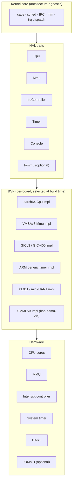
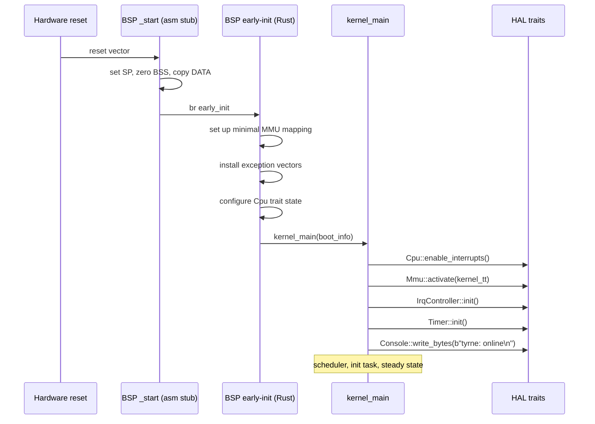

# Hardware Abstraction Layer (HAL) design

The HAL is the trait surface that separates the kernel core from any specific CPU, board, or peripheral. The kernel depends only on the traits; a per-board **Board Support Package (BSP)** implements the traits concretely. Drivers are **not** part of the HAL — they live in userspace as ordinary tasks with capability-granted access to hardware (see [overview.md](overview.md)). This document describes what the HAL covers, what it deliberately does not, the initial trait surface, how BSPs plug in, and the two BSPs that bootstrap the project: `bsp-qemu-virt` and `bsp-pi4`.

## Context

The HAL exists because of three commitments:

- [ADR-0004: Target hardware platforms and support tiers](../decisions/0004-target-platforms.md) — Tyrne targets multiple aarch64 platforms (QEMU, Pi 4, Pi 5, Jetson CPU, eventually RISC-V). Per-target code must be isolated behind a stable interface.
- [Architectural principle P6](../standards/architectural-principles.md#p6--hal-separation) — kernel code does not directly reference any specific CPU, board, or peripheral. Hardware details live behind HAL traits and types.
- [Architectural principle P3](../standards/architectural-principles.md#p3--drivers-filesystems-and-network-stacks-live-in-userspace) — drivers run as userspace tasks, not in the kernel. The HAL is therefore *not* a driver framework; it is strictly what the kernel itself needs.

The HAL is narrow for the same reason the kernel is small: every line of HAL code runs in privileged mode, is part of the TCB, and shows up in `unsafe` audits. A wide HAL would undo the TCB-minimization work that [ADR-0001](../decisions/0001-microkernel-architecture.md) is founded on.

## Design

### What the HAL is, and is not

The HAL **is**:

- A set of Rust traits (plus a few associated types and constants) that the kernel core calls to perform architecture- and board-specific operations.
- The boundary the kernel uses to abstract CPU privileged state, the MMU, the interrupt controller, the monotonic timer, and a minimal boot-time console.
- Where the majority of the kernel's `unsafe` code lives (MMIO, barrier instructions, translation-table manipulation, inline assembly). Each `unsafe` region is audited per [unsafe-policy.md](../standards/unsafe-policy.md).

The HAL **is not**:

- A driver layer. Drivers for UART beyond boot, block devices, network interfaces, USB, GPIO, sensors, and every other peripheral live in userspace tasks with capability-granted access.
- A device-tree parser. Device-tree handling, where needed (e.g. Pi 4), is performed by a separate crate and fed into boot-info; the HAL traits see only typed memory ranges and IRQ numbers.
- A portable POSIX-style device abstraction. Tyrne does not promise a "common driver API"; drivers talk to services above them in their own protocol.
- A runtime that the kernel queries to discover hardware. The BSP is selected at build time and the kernel knows what it got.

### Where the HAL lives in the layering

The kernel depends only on the trait layer. A build with a different BSP is a different binary; the kernel's `Cargo.toml` cannot name any specific BSP.

### HAL trait surface

This section describes the traits at a high level. Each trait will have a dedicated ADR when its signature is finalized in Phase 4, because small decisions (error-type shape, `&self` vs. `&mut self`, generic vs. associated types) compound. Treat the bullet points below as the trait's *responsibilities*, not its final signature.

#### `Cpu`

Privileged CPU state and control. Implementations are architecture-specific.

- Current core identifier.
- Number of cores online.
- Enable / disable IRQs at the CPU level (PSTATE on aarch64).
- `wait_for_interrupt()` — low-power halt until the next interrupt.
- Context save / restore primitives used by the scheduler.
- Memory barriers that Rust's atomics do not cover.
- Secondary-core start via PSCI (or architecturally equivalent mechanism).

Most methods are `unsafe fn`. The kernel wraps them with safe helpers that encode the preconditions.

#### `Mmu`

Virtual memory management primitives. The translation-table format is an associated type; the kernel sees page-table entries only through typed helpers.

- Activate a translation-table base (set TTBR0/TTBR1 on aarch64).
- Install a page-table entry mapping virtual → physical with rights flags.
- Remove a page-table entry.
- Invalidate TLB entries — per-ASID, global, per-address.
- Emit the cache maintenance sequence required by the architecture between writing a table entry and relying on the MMU having seen it.
- Expose the supported granule sizes and permission flag set as compile-time constants.

Memory allocation for page tables is not the HAL's job — the kernel owns a physical-frame allocator and hands the HAL frames to fill in.

#### `IrqController`

Dispatch and control of the board's interrupt controller.

- Enable / disable a specific IRQ line.
- Acknowledge the current IRQ at entry (returns the IRQ number).
- End-of-interrupt signalling at exit.
- Route an IRQ to a specific CPU (optional; SGI/PPI vs. SPI distinctions on GIC).
- Set priority and edge/level configuration (optional; some hardware is fixed).

The kernel uses this trait from inside its minimal ISR, which is deliberately short (identify → notify → EOI). Drivers never see this interface; they receive asynchronous notifications on their `IrqCap`'s endpoint.

#### `Timer`

Monotonic time and timed deadlines.

- `now_ns() -> u64` — nanoseconds since boot, monotonic, never goes backwards across suspends.
- Arm a one-shot deadline; arrival is delivered as an IRQ on the timer's line.
- Cancel a deadline.
- Expose the timer's resolution and its worst-case arming overhead as constants.

The kernel uses this for scheduler tick, deadline-based wakeups, and the `time_now` / `time_sleep_until` syscalls.

#### `Console`

A byte sink for the earliest possible diagnostic output.

- `write_bytes(&[u8])` — writes synchronously, ignoring partial failures during panic.
- No formatting, no levels, no buffering. That's the log service's job (userspace).
- Typically implemented over a single UART's MMIO registers.
- Works before the MMU is active (BSP early-init) and continues to work after.

The console is used during boot (before the log service is up), during panic (when nothing else can be trusted), and — optionally, gated by a build flag — for debug output in development builds.

#### `Iommu` (platforms with an IOMMU)

Programs the system IOMMU (SMMUv3 on aarch64 platforms that have one) to scope a peripheral's DMA to the regions granted to its driver.

- Install a stream-to-address-space mapping.
- Update or remove such a mapping.
- Invalidate IOMMU caches when mappings change.

See [security-model.md — Trust boundary 7](security-model.md) for the security role the IOMMU plays. `bsp-qemu-virt` implements this trait; `bsp-pi4` does not (the Pi 4 has no IOMMU) and the trait is therefore either absent or a no-op on that target — an explicit decision in a future ADR.

### BSP structure

A BSP is a Rust crate named `bsp-<board>` that provides:

1. **An entry point** — the architecture reset vector (`_start`), implemented as a small assembly stub that sets up a stack, zeros BSS, and jumps into Rust early-init.
2. **Early-init Rust code** that configures the MMU with a minimal identity + high-half mapping, installs exception vectors, and hands control to `kernel_main(boot_info)`.
3. **Implementations of the HAL traits** — `Cpu`, `Mmu`, `IrqController`, `Timer`, `Console`, and `Iommu` where applicable.
4. **Board-specific constants** — MMIO base addresses, IRQ numbers, expected memory layout — as a `bsp::config` module, not spread across the crate.
5. **A linker script** specifying where the kernel image is loaded, where RAM begins, and any reserved regions.

A BSP is expected to be roughly 1 000 – 2 500 lines of Rust plus a few dozen lines of assembly. Significantly larger suggests driver logic has sneaked in and should be extracted to userspace.

### BSP selection

BSPs are selected at **build time**, not runtime. The mechanism is a workspace-level target configuration plus a single-BSP dependency per kernel binary. Two binaries differing only in BSP are different artifacts.

- `cargo build --target aarch64-unknown-none -p tyrne-kernel-qemu-virt`
- `cargo build --target aarch64-unknown-none -p tyrne-kernel-pi4`

Runtime multi-board support (one kernel binary that detects its host and selects a BSP) is explicitly **not** a goal. The policy is justified by ADR-0004 and by the security argument: runtime detection expands the TCB with detection logic and conditional code paths that no deployment exercises all of.

### Initial BSPs

#### `bsp-qemu-virt` — primary dev BSP

| Property | Value |
|----------|-------|
| Architecture | aarch64 |
| CPU | generic ARMv8-A (whatever QEMU exposes for `-cpu max` / `-cpu cortex-a72`) |
| RAM base | `0x4000_0000` |
| Interrupt controller | GICv3 |
| Console | PL011 UART at `0x0900_0000` |
| Timer | ARM generic timer |
| IOMMU | SMMUv3 (optional, enabled with `-device smmuv3`; CI uses it) |
| Boot loader | none — QEMU loads the ELF and jumps to `_start` |
| Secondary-core start | PSCI |
| Virtio | present (virtio-mmio); used by userspace drivers in future phases |

This is the first target Tyrne boots on and the one where every feature's first QEMU smoke test runs.

#### `bsp-pi4` — first real-hardware BSP

| Property | Value |
|----------|-------|
| Architecture | aarch64 |
| CPU | Cortex-A72 (BCM2711), 4 cores |
| RAM base | `0x0000_0000` (RAM starts at zero on Pi) |
| Interrupt controller | GIC-400 (v2, compatible subset) |
| Console | PL011 UART (primary); mini-UART available as alternate |
| Timer | ARM generic timer |
| IOMMU | **none** — see [security-model.md](security-model.md) for the consequences and release-note policy |
| Boot loader | Pi firmware (`start4.elf`) loads `kernel8.img`; `config.txt` sets `arm_64bit=1`, `kernel_address=0x80000` |
| Secondary-core start | PSCI via firmware / spin-table on some revisions |
| Peripherals | BCM2711 ARM local peripherals + legacy BCM2835-descended block |

The Pi 4 bring-up is the first exit from QEMU. The work exercises every assumption the kernel has been making about aarch64 generality.

#### `bsp-pi5` — follow-on

Cortex-A76 on BCM2712. Follows Pi 4 once the Pi 4 BSP is stable. The HAL trait surface must be sufficient unchanged; Pi 5 should add only what is genuinely new to the SoC (RP1 southbridge, etc.).

#### Future BSPs

- **Jetson Orin Nano / NX / AGX Orin** (aarch64 CPU only, per security-model caveat): once the Pi 4 and Pi 5 BSPs shape the HAL's final form.
- **RISC-V embedded boards** (SiFive HiFive, ESP32-C6 class): triggers adding RISC-V to the set of architectures the HAL accommodates. Several traits (`Cpu`, `Mmu`, `IrqController`) will gain a second architecture-specific implementation lineage.
- **Mobile-class aarch64 SoCs**: years out. The HAL trait surface should require no structural change; the work is a new BSP.

### Boot handoff, in detail

The BSP's responsibility ends at the call to `kernel_main`; from that point the kernel owns the CPU and calls the HAL for specific operations. The BSP does not run a "main loop" of its own.

### `boot_info`

The BSP hands `kernel_main` a `BootInfo` structure describing what the kernel can assume about the machine. At this level of detail the shape will be refined in an ADR; the responsibilities are:

- **Memory map.** Regions of usable RAM, regions reserved (BSP code, firmware, device MMIO windows).
- **Boot CPU ID and the total core count** (which need not match — the BSP may choose to leave some cores offline).
- **Device-tree pointer** or a BSP-specific equivalent configuration handle. The kernel treats the DT as opaque; a future `tyrne-dt` crate parses it into typed records.
- **Initial capability seed.** The first capabilities the init task will hold — typically a handful: its own `TaskCap`, an address-space cap, a handful of memory caps covering the init image, an IRQ cap for the console, and nothing else.

`BootInfo` is typed Rust; the BSP constructs it and passes it by value. No mutation is expected after handoff.

### Error handling in the HAL

Most HAL methods that can fail at runtime return `Result<_, HalError>`. A small number (the ones called during panic, or the ones whose failure would indicate a hardware bug the kernel cannot meaningfully handle) are allowed to `panic!` — because at that point the kernel is already corrupted. This is consistent with [error-handling.md — Panic strategy](../standards/error-handling.md).

HAL methods **do not allocate**. The kernel hands the HAL any working memory it needs (physical frames for page tables, stack space for secondary-core start, etc.). This keeps the HAL free of allocator dependencies and makes its behaviour deterministic.

### `unsafe` in the HAL

The HAL is where most of Tyrne's `unsafe` lives. By construction:

- Every MMIO access goes through an `unsafe` region.
- Every privileged-state manipulation (system registers, barriers, CPU mode changes) is `unsafe`.
- Every context-switch primitive is `unsafe` at least internally.

The [unsafe-policy.md](../standards/unsafe-policy.md) applies in full: each `unsafe` block has a `SAFETY:` comment, an entry in [`docs/audits/unsafe-log.md`](../audits/) (created with the first `unsafe` block that lands), and security-review approval on the commit that introduces it.

A well-structured BSP wraps most of its unsafe code in a small number of typed abstractions (`Mmio<T>`, `SystemRegister<T>`) and implements the HAL traits in terms of those. This keeps the audit surface concentrated rather than diffuse.

### Testing the HAL

Testing a HAL is largely testing that two independent BSP implementations behave the same at the trait boundary.

- **`test-hal`** — a separate crate (planned with Phase 4 scaffolding) that provides fake implementations of the HAL traits for host-side tests. The fake `Timer` is deterministic (`advance(ns)`); the fake `IrqController` is a queue of pending IRQs; the fake `Console` captures output. The fake `Mmu` is metadata-only (it records "this VA is mapped to this PA with these rights") without real page tables. This lets the kernel core be unit-tested on a laptop.
- **QEMU smoke tests** — exercise a real BSP (`bsp-qemu-virt`) against QEMU's fidelity. Any behaviour divergence between `test-hal` and QEMU is a bug in whichever side claims to match the architecture.
- **Hardware smoke tests** — run on the Pi 4 during release preparation. Required per [release.md](../standards/release.md) before a release that claims Tier-2 support for that board.

## Invariants

- **Kernel core contains no architecture- or board-specific code.** If the word `aarch64`, `cortex`, `bcm`, `pi`, `qemu`, `x86`, or a numeric MMIO address appears in a kernel-core crate, that is a review-level bug.
- **The HAL is a trait surface, not a driver layer.** No peripheral driver (UART-beyond-boot, block, network, USB, GPIO, sensor) is part of a BSP or the HAL.
- **BSP selection is compile-time.** No runtime dispatch over "which BSP am I on."
- **HAL methods do not allocate.** They are handed any working memory they need.
- **Every HAL `unsafe` block is audited.** An entry in the audit log, a `SAFETY:` comment, a security-review sign-off.
- **BSP code paths are deterministic at boot.** A given BSP on a given board produces the same sequence of HAL calls on every cold boot.
- **No proprietary binary blob enters a BSP.** Firmware loaded by the pre-kernel boot loader (e.g., Pi `start4.elf`) lives outside the Tyrne build; an Tyrne BSP does not embed closed-source code.

## Trade-offs

- **Narrow HAL means more code overall.** Pushing drivers to userspace makes the kernel simpler and smaller but the system as a whole larger. We accept this because review complexity is what scales badly with TCB size; total code size is manageable.
- **Compile-time BSP selection forecloses a "universal kernel."** A single binary that boots on Pi 4, QEMU virt, and Jetson is impossible under this design. It is also unnecessary: Tyrne ships per-board artifacts.
- **Multi-architecture support compounds the trait count.** Adding RISC-V later means a second implementation lineage under every architecture-sensitive trait. The blast radius is bounded by the HAL's narrowness.
- **IOMMU optionality is a real gap on Pi 4.** We pay this in the security model; the HAL does not paper over it. See [security-model.md](security-model.md).
- **Runtime errata handling is inconvenient.** CPU errata workarounds have to live somewhere. A first cut keeps them in the BSP (per-CPU-variant feature flag); a future ADR may introduce a per-CPU crate layer above the BSP if the bookkeeping outgrows the BSP.

## Open questions

- Final trait signatures — each HAL trait gets its own ADR at Phase 4 implementation time.
- Handle-based vs. module-level trait usage — does the kernel carry a `&mut HalCtx` with every call, or are traits static-like through a selected implementation crate? Both patterns exist in embedded Rust; the choice affects how the test-hal overrides work.
- Errata layer — BSP-embedded vs. per-CPU crate above the BSP.
- Device-tree parser placement — separate crate fed into boot-info, or a HAL service the kernel can call?
- IOMMU trait shape — one trait for all IOMMU families, or per-architecture (SMMUv2, SMMUv3, Intel VT-d)? Relevant once the first non-SMMU IOMMU is in scope.
- Multi-socket systems — out of initial scope; the HAL accommodates "cores" but not "sockets"; deferred.
- Power-management interfaces — idle states, DVFS. Not in the initial HAL; added when a concrete deployment requires it.
- Secondary-core rendezvous semantics when PSCI is not available or is buggy — Pi 4 has quirks.

## References

- [ADR-0001: Capability-based microkernel architecture](../decisions/0001-microkernel-architecture.md).
- [ADR-0004: Target hardware platforms and support tiers](../decisions/0004-target-platforms.md).
- [Architectural principles — P3, P6](../standards/architectural-principles.md).
- [overview.md](overview.md) — the architectural context this document elaborates.
- [security-model.md](security-model.md) — for the trust-boundary role of the IOMMU / BSP.
- [unsafe-policy.md](../standards/unsafe-policy.md) — for the `unsafe` audit discipline the HAL lives inside.
- ARM *Reference Manual* (ARMv8-A) — PSCI, GIC, generic timer, MMU, SMMU.
- *BCM2711 ARM Peripherals* — Raspberry Pi 4 SoC documentation.
- QEMU aarch64 `virt` machine documentation: https://qemu.readthedocs.io/en/latest/system/arm/virt.html
- Hubris HAL abstractions — https://hubris.oxide.computer/
- `cortex-a` / `aarch64-cpu` crate documentation.
