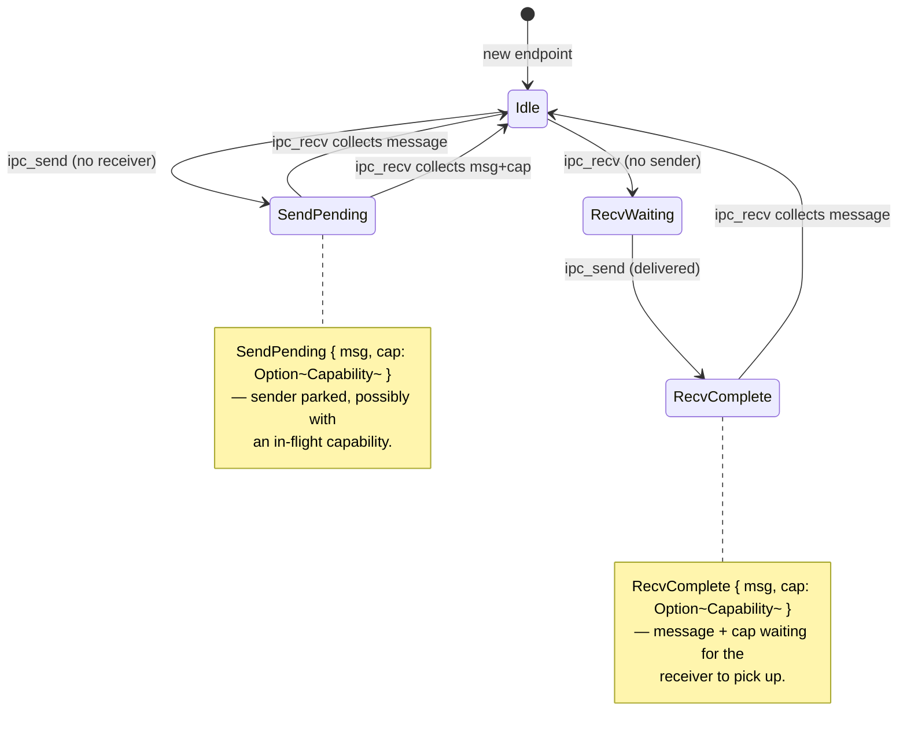
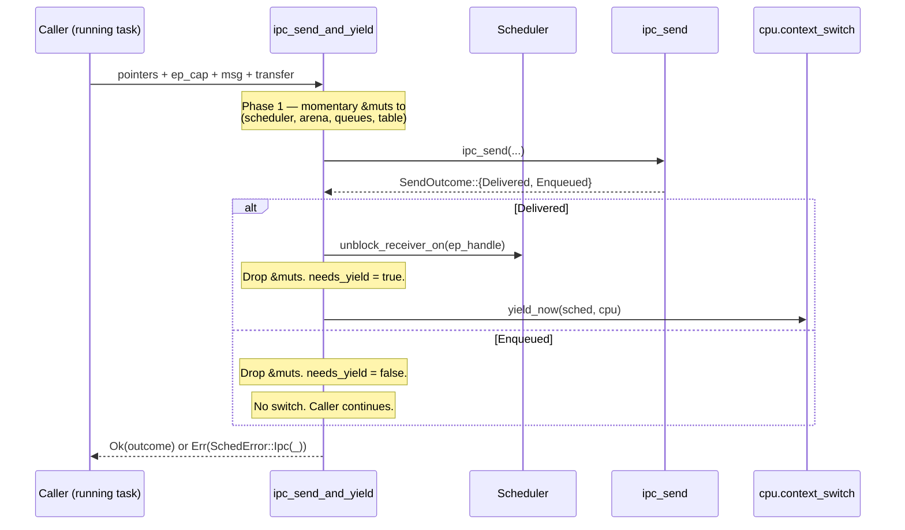

# Inter-process communication (IPC)

Tyrne's IPC is a synchronous-rendezvous send/receive primitive plus a non-blocking notification primitive, both mediated by the kernel and both gated by capabilities. A message is a small fixed-size struct; an `Endpoint` is a kernel object that pairs at most one sender and one receiver at a time. Capabilities can ride along with messages — moved out of the sender's capability table at send time, parked inside the endpoint state, installed into the receiver's table at recv time. The same operations are wrapped by the scheduler's *raw-pointer bridge* so that a blocked send or receive yields the running task; that wrapper is the seam between [`scheduler.md`](scheduler.md) and this document. The *why* for each shape decision lives in the linked ADRs.

## Context

Three Accepted ADRs and one Phase-A task fix the IPC design:

- [ADR-0017: IPC primitive set](../decisions/0017-ipc-primitive-set.md) — Tyrne offers exactly three primitives: synchronous `ipc_send`, synchronous `ipc_recv`, and non-blocking `ipc_notify`. No reply-recv composite primitive in v1.
- [ADR-0018: Badge scheme and reply-recv deferral](../decisions/0018-badge-scheme-and-reply-recv-deferral.md) — endpoint badge handling and the deferral of seL4-style `reply_recv` to a later phase.
- [ADR-0021: Raw-pointer scheduler IPC-bridge API](../decisions/0021-raw-pointer-scheduler-ipc-bridge.md) — the scheduler-side wrapper functions that block / yield / resume around the IPC primitives. The discipline behind the wrappers is summarised in [`scheduler.md`](scheduler.md) §"The raw-pointer bridge".
- [T-003 (Phase A IPC primitive set)](../analysis/tasks/phase-a/T-003-ipc-primitives.md) and [T-005 (two-task IPC demo)](../analysis/tasks/phase-a/T-005-two-task-ipc-demo.md) shipped the implementation; [T-006](../analysis/tasks/phase-b/T-006-raw-pointer-scheduler-api.md) refactored the scheduler-side wrapper.

Why a custom IPC layer rather than reusing a port from another microkernel? ADR-0017 §"Decision drivers" enumerates: capability-system interaction (capabilities must move atomically with messages, which most ports do not), tight kernel-object coupling (endpoints share their state machine with the scheduler's wake path), and audit-friendliness (the entire IPC surface fits in one ~990-line file under `unsafe-policy.md` review).

## Design

### The three primitives

| Function | Purpose | Blocking? | Returns |
|---|---|---|---|
| `ipc_send(ep_arena, queues, ep_cap, table, msg, transfer)` | Send a message; optionally transfer a capability with it. | Non-blocking at the kernel level; the scheduler's wrapper (`ipc_send_and_yield`) decides whether the caller yields. | `SendOutcome::{Delivered, Enqueued}` or `IpcError`. |
| `ipc_recv(ep_arena, queues, ep_cap, table)` | Receive a message; collect a transferred cap if present. | Non-blocking at the kernel level; the scheduler's wrapper (`ipc_recv_and_yield`) blocks the caller when no message is ready. | `RecvOutcome::{Received { msg, cap }, Pending}` or `IpcError`. |
| `ipc_notify(notif_arena, notif_cap, table, bits)` | OR `bits` into a `Notification`'s saturating word. | Always non-blocking; no waiter wake-up in v1. | `()` or `IpcError`. |

The three are free functions in `kernel/src/ipc/mod.rs`; they take the arenas and the caller's capability table by `&mut`. They never block on their own — blocking is the scheduler-bridge wrapper's job. This separation lets host tests exercise the IPC state machine without booting a scheduler ([T-003](../analysis/tasks/phase-a/T-003-ipc-primitives.md) wrote the bulk of the existing IPC tests this way).

### `Endpoint` and its state machine

Each endpoint slot has one `EndpointState` value at a time:



Four states, two of which carry an optional `Capability`:

- **`Idle`** — no traffic; the endpoint is empty.
- **`SendPending { msg, cap }`** — a sender arrived first; the message (and optionally the transferred cap) is parked in the endpoint until a receiver shows up.
- **`RecvWaiting`** — a receiver arrived first; nothing is parked yet, but the endpoint records that a receiver is registered. (No `cap` field — a receiver carries no cap into the endpoint.)
- **`RecvComplete { msg, cap }`** — a sender has already delivered to a registered receiver; the message and cap wait one operation longer for the receiver to call `ipc_recv` and collect them. (In A5+ the scheduler unblocks the receiver immediately; this state exists for the brief window between delivery and pickup.)

Depth is **one** — at most one sender or receiver waits per endpoint at a time. A second arrival sees `IpcError::QueueFull`. Multi-waiter shapes are deferred to a future ADR (per [ADR-0019](../decisions/0019-scheduler-shape.md) §"Open questions" and [ADR-0017](../decisions/0017-ipc-primitive-set.md)).

### `IpcQueues`: states + slot generations

The IPC layer owns one large array of states, indexed by an `EndpointHandle`'s slot index. Alongside it lives a parallel array of `slot_generations: [u32; ENDPOINT_ARENA_CAPACITY]` that records the generation of the endpoint that last touched each slot. When a new endpoint is allocated in the same slot index after the previous one was destroyed, the new handle's generation is greater than the recorded value. The IPC layer's helper `reset_if_stale_generation` detects the mismatch on every access and resets the slot to `Idle` before the new endpoint observes anything.

```mermaid
flowchart LR
    A[Old endpoint slot 0<br/>state = RecvWaiting<br/>slot_generations[0] = 7]
    B[Destroy old endpoint<br/>arena's slot generation bumps to 8]
    C[Allocate new endpoint<br/>handle.gen = 8<br/>state[0] still RecvWaiting<br/>slot_generations[0] still 7]
    D{Next ipc_*}
    E[reset_if_stale_generation<br/>handle.gen 8 != 7<br/>→ state[0] = Idle<br/>slot_generations[0] = 8]
    A --> B --> C --> D --> E
```

The reset-on-mismatch path also runs an in-debug assertion: if the prior state was `SendPending { cap: Some(_) }` or `RecvComplete { cap: Some(_) }`, the destruction path forgot to drain the in-flight capability and is leaking it. Phase B will introduce the explicit drain-before-destroy invariant; until that path exists, the assertion is the loud guard. T-011's `stale_send_pending_with_some_cap_panics_in_debug` test (gated by `#[cfg(debug_assertions)]`) pins the assertion; the paired `stale_recv_waiting_resets_silently` and `stale_send_pending_without_cap_resets_silently` tests prove the predicate is not over-broad.

### Capability transfer

A capability moves out of the sender's table, parks in the endpoint state, and reappears in the receiver's table — exactly once. The pre-flight discipline:

1. **Sender-side validation.** `ipc_send` first looks up `ep_cap` in the sender's table and confirms it carries the `SEND` right (and `TRANSFER` for any `transfer: Some(_)`). The endpoint handle is resolved against the arena. The transfer cap's `lookup` happens *before* any state mutation.
2. **Receiver-side pre-flight.** `ipc_recv` peeks the endpoint state non-destructively. If the pending state carries a `Some(cap)` and the receiver's table is `is_full()`, the call returns `IpcError::ReceiverTableFull` *before* any state mutation. The capability stays parked in the endpoint, available for the next `ipc_recv` after the receiver frees a slot.
3. **Atomic move on commit.** Once both pre-flights pass, `ipc_send` calls `cap_take` on the sender's table (removing the cap with the slot's generation bumped), and `ipc_recv` calls `insert_root` on the receiver's table (inserting the cap and producing a fresh handle). Both functions are infallible at this point because the pre-flights cleared every error condition.

The "park in endpoint state" step is what makes the transfer atomic: even if the receiver hasn't called `ipc_recv` yet, the cap is no longer in the sender's table — it cannot be sent twice or mutated.

### `IpcError` taxonomy

```text
IpcError::InvalidCapability     // ep_cap stale, wrong kind, or lacks the required right
IpcError::QueueFull              // a previous sender/receiver still occupies the endpoint
IpcError::InvalidTransferCap    // transfer-handle stale or lacks TRANSFER
IpcError::ReceiverTableFull     // pre-flight: receiver's cap table has no free slot
IpcError::PendingAfterResume    // scheduler-bridge invariant violation; see scheduler.md
```

The enum is annotated `#[non_exhaustive]`, which deliberately *opens* it for future extension: external matches must include a wildcard arm, so new variants can be added without silently breaking callers. `PendingAfterResume` is special among the variants — it is produced *only* by the scheduler bridge's resume path, never by the bare `ipc_recv` primitive, and it indicates a kernel-internal invariant violation rather than a userspace-reachable error. ADR-0022 §Revision notes (second rider) records why the typed return replaces a `debug_assert!` that was untestable.

### The scheduler-bridge wrappers

The two wrappers in `kernel/src/sched/mod.rs` — `ipc_send_and_yield` and `ipc_recv_and_yield` — combine an IPC operation with the scheduler-state mutation that "this task wants to yield" implies.



`ipc_recv_and_yield` is structurally similar but with three phases: Phase 1 attempts a non-blocking `ipc_recv`; on `Pending` it transitions to Phase 2 which records the calling task as `Blocked { on: ep }`, dequeues the next ready task, and switches; on resume Phase 3 retries `ipc_recv` to collect the now-delivered message. If the resume-path `ipc_recv` still returns `Pending`, the bridge returns `SchedError::Ipc(IpcError::PendingAfterResume)` rather than letting `Ok(Pending)` propagate into a caller that would turn it into a downstream panic.

The wrappers' raw-pointer signature is the topic of [ADR-0021](../decisions/0021-raw-pointer-scheduler-ipc-bridge.md) and is summarised in [`scheduler.md`](scheduler.md). The audit entries live at [`UNSAFE-2026-0013`, `UNSAFE-2026-0014`](../audits/unsafe-log.md).

### BSP-side discipline

The BSP calls the wrappers through `*mut Scheduler<C>`, `*mut EndpointArena`, `*mut IpcQueues`, and `*mut CapabilityTable` — four raw pointers, each derived exactly once from `&mut <referent>` and reused for the lifetime of the bridge call. Two specific patterns must hold:

1. **Single derivation per pointer.** Re-borrowing through `core::ptr::from_mut(&mut x)` twice on the same referent invalidates the earlier pointer's Stacked-Borrows tag. The BSP must hand each pointer to the wrapper exactly once and must not interleave a `&mut x` borrow that would re-tag. UNSAFE-2026-0014 captures the audit context.
2. **`StaticCell::as_mut_ptr` for the arena pointers.** The BSP's static-cell helpers expose `as_mut_ptr` instead of letting the caller materialise a `&mut`. UNSAFE-2026-0013 documents the helper's safety contract.

The discipline is mechanical and is verified at host-test time by Miri's Stacked Borrows checker (currently 143/143 clean across the workspace per [the 2026-04-27 coverage rerun](../analysis/reports/2026-04-27-coverage-rerun.md)). The two-task demo's `task_a` and `task_b` ([`bsp-qemu-virt/src/main.rs`](../../bsp-qemu-virt/src/main.rs)) are the canonical reference for the discipline.

## Invariants

- **Move-only capabilities.** A `Capability` (the kernel object) is non-`Copy`; it is moved out of the sender's table and into the endpoint state in exactly one place (`take_cap_if_some`). The receive path moves it out of the endpoint and into the receiver's table (`install_cap_if_some`). At no point does the kernel hold two `Capability` instances pointing at the same authority.
- **Pre-flight before mutation.** Every `ipc_send` / `ipc_recv` error path returns *before* any state mutation. The state machine never enters a half-transitioned shape that a caller would have to roll back. The `ReceiverTableFull` test ([T-011](../analysis/tasks/phase-b/T-011-missing-tests-bundle.md)) pins this for the receive-side cap-transfer path.
- **Stale slot resets.** Any operation on an endpoint handle whose generation has moved past the recorded `slot_generations` value resets the slot to `Idle` before observing it. The reset is unconditional and the in-debug assertion guarantees no in-flight cap is silently dropped.
- **Single-waiter per endpoint.** A second sender or receiver arriving while one is already pending sees `IpcError::QueueFull`. The endpoint is not a fan-in or fan-out structure; multi-waiter primitives need their own ADR and a different state machine.
- **No `&mut` across context switch.** Every momentary `&mut` materialised inside the bridge wrappers ends in a `}` before the unsafe `cpu.context_switch` block. Stacked Borrows verifies this on every Miri test run.

## Trade-offs

- **Depth-1 endpoints.** A single waiter per endpoint keeps the state machine tractable for the audit pass and lets host tests assert exhaustively. Real-world IPC patterns sometimes want fan-in (multiple senders → one receiver) or fan-out (multiple receivers → one sender); v1 makes callers serialise on top of `IpcError::QueueFull` retries. Multi-waiter shapes are open and ADR-pending.
- **No `reply_recv` composite primitive.** ADR-0018 defers seL4-style `reply_recv` to a later phase. Server tasks therefore pay an extra syscall (separate `recv` then `send`) per request. The cost is small at v1's IPC volumes; reconsidered when measurement justifies the added complexity.
- **No async / non-blocking `recv`.** The only non-blocking primitive is `ipc_notify` for events that don't carry a payload. A "try-recv" flavour would help certain idle-poll patterns; deferred until a concrete user surfaces.
- **Capability-table-full pre-flight is a `is_full()` scan, not a per-slot reservation.** The reservation alternative is materially more state to track and audit; the scan is `O(1)` against `CAP_TABLE_CAPACITY`. Acceptable while the cap table is small.

## Open questions

- **Multi-waiter endpoint shapes.** FIFO? Priority-ordered? Broadcast? Open.
- **`reply_recv` composite primitive.** Re-evaluated in a later phase per ADR-0018.
- **`ipc_try_recv`.** Non-blocking variant of `ipc_recv` for poll patterns. Open.
- **Endpoint destruction-with-pending-cap policy.** The `reset_if_stale_generation` assertion catches the leak in debug; production policy (forced drain at destroy-time? cap returned to last-known holder?) is open and will need an ADR.
- **Notification waiter wake-up.** `ipc_notify` is fire-and-forget today; if Phase B introduces `wait_notify_and_yield`, the notify path must add an unblock step, otherwise notify-waiters silently sleep forever.

## References

- [ADR-0017 — IPC primitive set](../decisions/0017-ipc-primitive-set.md) — three-primitive choice and its alternatives.
- [ADR-0018 — Badge scheme and reply-recv deferral](../decisions/0018-badge-scheme-and-reply-recv-deferral.md) — endpoint badge design + reasons to defer `reply_recv`.
- [ADR-0021 — Raw-pointer scheduler IPC-bridge API](../decisions/0021-raw-pointer-scheduler-ipc-bridge.md) — the bridge's raw-pointer shape.
- [`docs/architecture/scheduler.md`](scheduler.md) — what the bridge does on the scheduler side.
- [T-003 — IPC primitive set](../analysis/tasks/phase-a/T-003-ipc-primitives.md) — the original implementation arc.
- [T-005 — Two-task IPC demo](../analysis/tasks/phase-a/T-005-two-task-ipc-demo.md) — the BSP-side reference implementation.
- [T-006 — Raw-pointer scheduler API refactor](../analysis/tasks/phase-b/T-006-raw-pointer-scheduler-api.md) — the move from `&mut self` to raw-pointer wrappers.
- [T-011 — Missing tests bundle](../analysis/tasks/phase-b/T-011-missing-tests-bundle.md) — the targeted coverage additions for IPC.
- [`kernel/src/ipc/mod.rs`](../../kernel/src/ipc/mod.rs) — the source.
- [`docs/audits/unsafe-log.md`](../audits/unsafe-log.md) — UNSAFE-2026-0013 / 0014 cover the unsafe regions.
