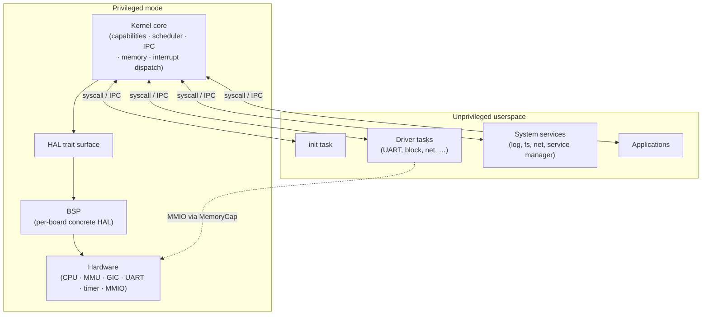
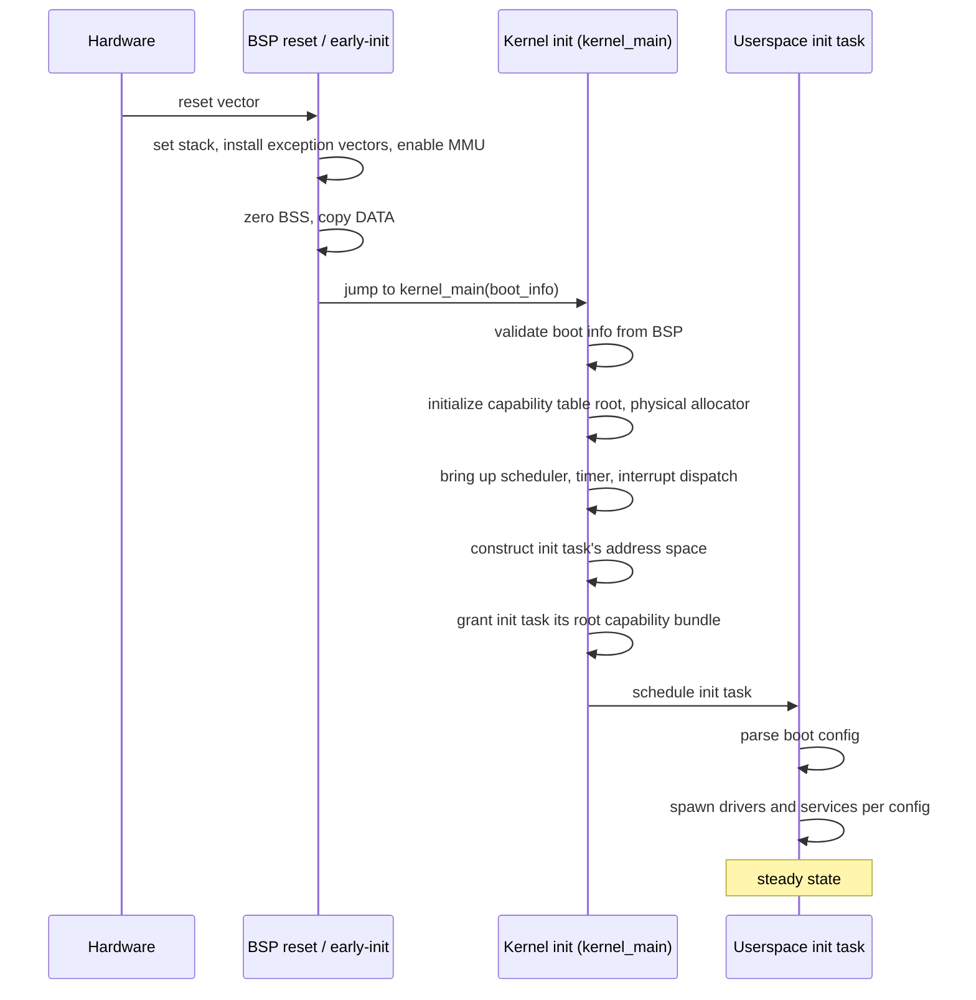
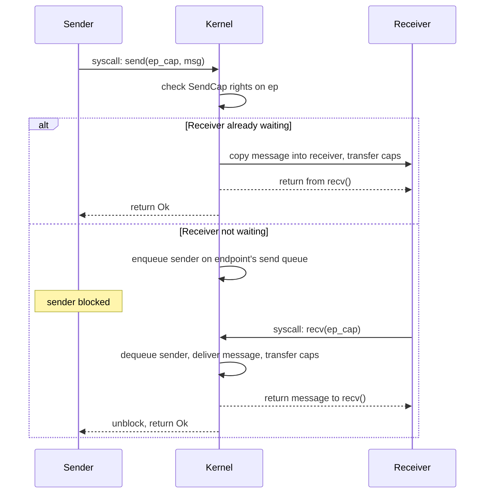

# Architecture overview

Tyrne is a capability-based microkernel whose system structure is deliberately narrow at the privileged layer and arbitrarily rich in userspace. This document describes the three layers that make up the running system — kernel, hardware abstraction layer, and userspace — what crosses each boundary, and the paths a boot and a message follow through them. It is the first architecture document a reader should open; every other `docs/architecture/` document elaborates one of the pieces summarized here.

## Context

The overall shape of Tyrne was fixed by the foundational ADRs:

- [ADR-0001: Capability-based microkernel architecture](../decisions/0001-microkernel-architecture.md) — only capabilities, scheduling, IPC, memory, and interrupts live in kernel mode.
- [ADR-0002: Rust as the implementation language](../decisions/0002-implementation-language-rust.md) — all kernel, HAL, and userspace code is Rust.
- [ADR-0004: Target hardware platforms and support tiers](../decisions/0004-target-platforms.md) — primary development on QEMU `virt` aarch64; first real hardware is the Raspberry Pi 4; aarch64 is the long-term portfolio.

Those decisions leave very little architectural room: the kernel must be small, userspace must be powerful, the HAL must exist as an explicit boundary, and Rust's ownership model is the tool we use to keep the whole thing honest. The rest of this document is a reading of how that translates into actual structure.

## Design

### Top-level layers

Tyrne has three layers: the **kernel**, a **hardware abstraction layer (HAL)** realized by per-board **Board Support Packages (BSPs)**, and **userspace**.

- **The kernel** holds a very small set of responsibilities. Everything that is not one of them — drivers, filesystems, network stacks, service supervision, shell — runs outside the kernel.
- **The HAL** is a set of Rust traits; concrete implementations live in BSPs. The kernel depends on the traits only.
- **Userspace** is where the interesting behaviour of the system lives. Userspace tasks talk to each other and to the kernel through capability-bound IPC.

### What the kernel does

The kernel is responsible for, and only for:

1. **Capability management.** Creation, transfer, derivation, and revocation of [capabilities](../glossary.md). The capability table of every task lives in kernel-owned memory; the table is never writable from userspace.
2. **Scheduling.** Choosing which runnable [thread](../glossary.md) executes on a CPU next; honouring priority and preemption policies.
3. **IPC.** Transporting messages between tasks' address spaces, rendezvouing senders and receivers, and moving capabilities along with the messages.
4. **Virtual memory management.** Creating and destroying address spaces, installing translation table entries under capability control, managing physical page allocation at a low level.
5. **Interrupt dispatch.** Trapping interrupts, performing the minimum work required to acknowledge the hardware, and turning the event into an asynchronous notification on an endpoint held by a userspace handler.

The kernel is **not** responsible for: drivers (every driver is a userspace task), filesystems (userspace), network stacks (userspace), shells (userspace), task supervision policy (userspace), or any form of ambient authority. See [architectural principle P1](../standards/architectural-principles.md#p1--no-ambient-authority).

### What the HAL does

The HAL is the trait boundary between the kernel's portable core and any one board's concrete hardware. It is not a driver layer; drivers live in userspace. It is the narrow interface the kernel needs to manipulate the CPU, the [MMU](../glossary.md), the interrupt controller, and a minimal boot-time console.

Expected HAL trait surface (final form documented in `hal.md`, planned):

- `Cpu` — disable / enable interrupts at the CPU level, halt / wait-for-interrupt, context-switch primitives.
- `Mmu` — translation-table layout, entry installation, TLB invalidation.
- `IrqController` — IRQ mask / unmask, acknowledge, end-of-interrupt.
- `Timer` — monotonic clock, one-shot deadline arming.
- `Console` — bytes-out for early boot and panic diagnostics.

A BSP is a crate that implements these traits for a specific target. Initial BSPs:

- `bsp-qemu-virt` — QEMU `virt` aarch64 (GICv3, PL011 UART, generic timer).
- `bsp-pi4` — Raspberry Pi 4 (BCM2711, legacy + GIC-400, mini-UART or PL011).

The kernel depends on HAL traits. It does not `use` a BSP directly; the BSP is selected at build time.

### What userspace looks like

Userspace is a collection of tasks. A **task** in Tyrne is:

- One or more threads.
- A private address space, created by the kernel under capability control.
- A capability table, referenced by the kernel when validating syscalls.
- A start entry point.

Tasks do not share memory by default. Shared memory is always the result of an explicit capability grant — the sender of a `MemoryRegionCap` allows the receiver to map the region — and is therefore auditable.

Tasks are composed into a service graph whose shape is set at boot by the **init task** (see *Boot flow* below). The init task is a userspace program: it is not special, except that the kernel hands it the first capability bundle.

Categories of userspace tasks expected to exist in Tyrne:

- **Driver tasks** — one per hardware function, holding `MemoryCap` for that function's MMIO region and `IrqCap` for its interrupts.
- **Service tasks** — filesystem, network, log, clock, crypto, storage. Stateless services are cheap to restart.
- **Supervisor tasks** — watch over a set of services, restart them on fault (see [error handling](../standards/error-handling.md) §8).
- **Application tasks** — end-user programs.

The kernel is indifferent to which category a task belongs to; categorization is userspace convention.

### Boot flow

A boot carries execution from the reset vector through a narrow channel of trusted code into the first userspace task.

The kernel hands execution to the init task once it is satisfied that:

- Capabilities, scheduling, IPC, memory, and interrupt dispatch are all live.
- The init task has an address space, a stack, an entry point loaded, and its initial capability bundle installed.

From that point, no code runs inside the kernel except in response to syscalls, interrupts, and faults.

### IPC

IPC is the central operation of a microkernel. Tyrne will offer two IPC flavours, both mediated by the kernel, both capability-controlled.

- **Synchronous rendezvous.** A sender issues `send(endpoint_cap, msg)` and blocks until a receiver pairs with the endpoint. Used for request-response. Inspired by seL4.
- **Asynchronous notification.** A sender fires a one-bit (or small-bit-field) notification that accumulates on the receiver's endpoint. Used for interrupts and low-rate signals. No block on the sender side.

Both flavours use the same `EndpointCap` kernel object, discriminated by capability rights at send/receive time.

Capabilities can be transferred **with** a message. The kernel validates that the sender holds the capabilities claimed and that the receiver's capability table has room; on success, the capabilities move atomically with the message. This transfer, combined with the rule that capabilities are move-only Rust types, is the vehicle by which authority flows around the system.

### Address spaces

Every userspace task has its own address space, backed by per-task translation tables that the kernel installs under capability control. The kernel has a single, boot-resident address space shared across CPUs; it is mapped into the upper half of every userspace address space as a kernel mapping inaccessible to userspace.

Operations on an address space are always capability-gated:

- `AddressSpaceCap` authorizes structural operations (create, destroy).
- `MemoryRegionCap` authorizes mapping a particular physical region into an address space with a particular set of rights.
- `UnmapCap` authorizes removal of existing mappings.

No userspace task can observe or alter another task's address space without holding a capability that names that address space.

### Interrupts

Interrupts are the event loop of the system.

1. Hardware raises an IRQ. The kernel's ISR entry saves state and identifies the IRQ line through the `IrqController` trait.
2. The kernel looks up the userspace task that holds the `IrqCap` for that line.
3. The kernel fires an asynchronous notification on the task's IRQ endpoint.
4. The kernel acknowledges the hardware and returns from the ISR.

The userspace handler eventually runs, reads the notification, services the device (via MMIO through its `MemoryCap`), and issues `irq_eoi(irq_cap)` to signal completion. This keeps the kernel's ISR minimal (a constant-time dispatch) and pushes all policy into the handling task.

See also [error-handling.md §9](../standards/error-handling.md) for the discipline expected inside ISR-like contexts.

### Syscall surface

The syscall surface is intentionally narrow. A first-cut enumeration (subject to evolution via ADR):

- Task lifecycle: `task_create`, `task_destroy`, `task_yield`.
- Address space: `as_create`, `as_destroy`, `as_map`, `as_unmap`.
- IPC: `send`, `recv`, `reply_recv`, `notify`.
- Capabilities: `cap_copy`, `cap_derive`, `cap_revoke`, `cap_drop`.
- Interrupt control: `irq_claim`, `irq_eoi`.
- Time: `time_now`, `time_sleep_until`.
- Diagnostics: `debug_put` (serial console, gated by a debug capability; absent in hardened builds).

Every syscall validates capability bearers before performing side effects. A syscall returns a typed `Result` encoding per the [error handling standard](../standards/error-handling.md).

## Invariants

These are properties the overall architecture maintains. They are concrete enough to be exercised by tests and checked during review.

- **Capability-or-deny.** Every kernel-mode operation that affects authority fails unless the caller holds an appropriate capability.
- **Mode separation.** Userspace code does not run in kernel mode; kernel code does not run in userspace.
- **No kernel dereferencing of userspace pointers.** The kernel never follows a userspace pointer without routing through a validated mapping.
- **Drivers in userspace.** No driver code runs in privileged mode. Every driver is a task holding `MemoryCap` + `IrqCap`.
- **ISR minimality.** The kernel's interrupt entry performs at most: state save, IRQ identification, notification fire, EOI, return. Driver-specific logic is not in the kernel.
- **Blob-free kernel.** No proprietary binary firmware or driver is linked into the kernel.
- **Explicit shared memory.** Memory shared between tasks exists only through capability grants; ambient sharing is impossible.
- **Move-only capabilities.** Capabilities are Rust move-only tokens; they cannot be silently duplicated.

## Trade-offs

The architecture is chosen for the assurance and portability properties above; it pays for them in known ways.

- **IPC on the hot path.** Every cross-task operation crosses an address-space boundary. Mitigation: synchronous rendezvous has a fast path that avoids unnecessary copies; the message encoding is picked to keep common paths small.
- **More design discipline per subsystem.** Adding a feature to Tyrne usually means designing a service interface, a capability model, and an IPC contract before writing behaviour. This is a feature for long-term reliability and a cost for short-term velocity. We accept it.
- **Driver authors write constrained userspace.** Drivers run under a scheduler they do not control, with a fixed memory budget they are granted rather than allocated. Tooling and guides (planned) will reduce this cost.
- **Capability-based thinking is unfamiliar.** Most developers arrive with POSIX intuitions. Documentation, the glossary, and skill files are how we absorb this cost.

## Open questions

Each of the following will be answered by a future ADR before the corresponding subsystem is implemented.

- Final IPC primitive set. Pure seL4-style rendezvous? Extended with fast-path fastcalls? Call-with-reply-capability as a single syscall?
- Async runtime model in userspace. Adopt an existing `no_std` async runtime, or write a minimal Tyrne-specific one?
- Capability derivation tree depth limits. Unbounded, bounded with explicit limit, or bounded with revocation cascade?
- Behaviour on task fault. Policy decisions pushed to supervisors; kernel mechanism needs to be pinned down.
- `no_std` allocator in the kernel. First cut: compile-time-sized pools only (Hubris-style). Whether and when to introduce a dynamic allocator is open.

## References

- [ADR-0001](../decisions/0001-microkernel-architecture.md) — capability-based microkernel choice.
- [ADR-0002](../decisions/0002-implementation-language-rust.md) — Rust as the implementation language.
- [ADR-0004](../decisions/0004-target-platforms.md) — target platforms and tiers.
- [Architectural principles](../standards/architectural-principles.md) — P1 through P12.
- [Glossary](../glossary.md).
- seL4 reference manual — https://sel4.systems/
- Hubris architecture — https://hubris.oxide.computer/
- Fuchsia / Zircon concepts — https://fuchsia.dev/fuchsia-src/concepts
- Klein et al., *"seL4: Formal Verification of an OS Kernel"* (2009).
