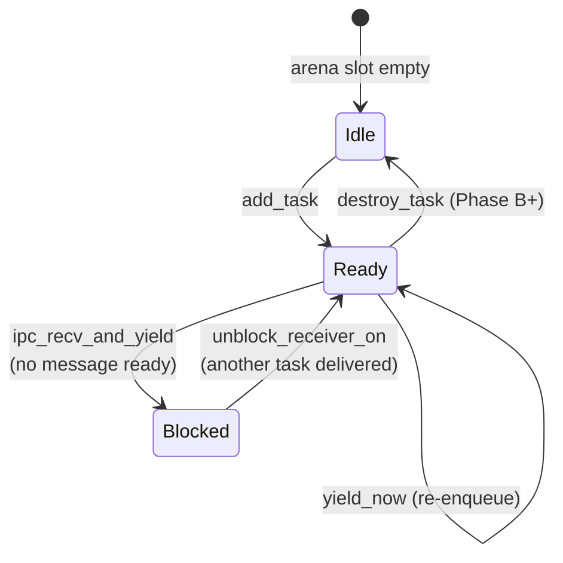
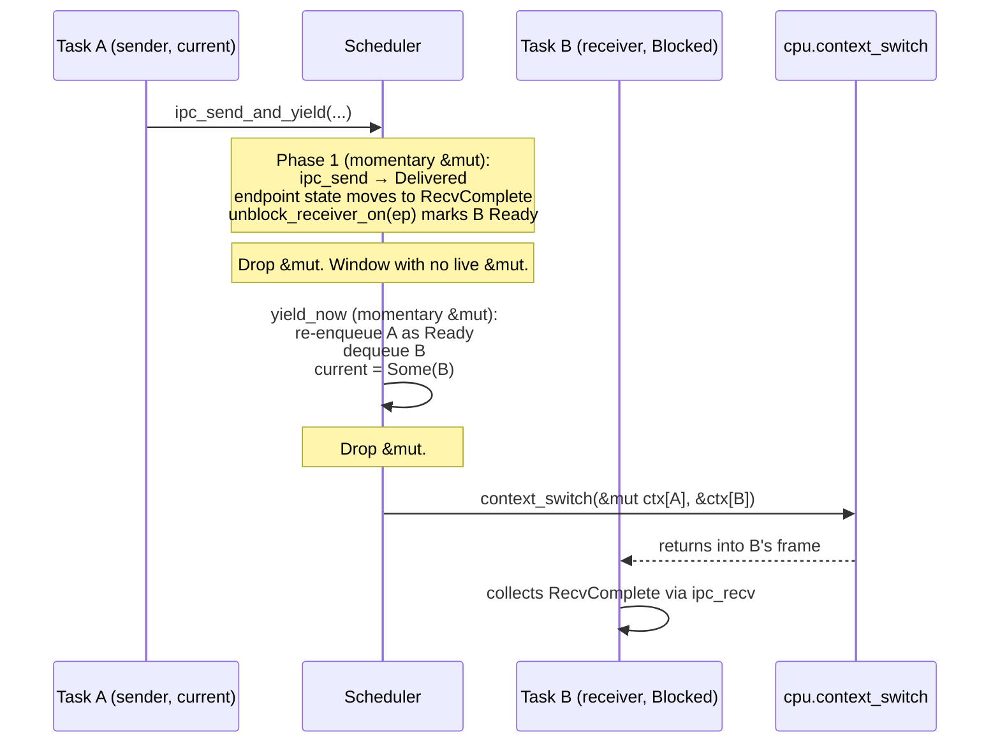

# Scheduler design

Tyrne's scheduler is a cooperative, single-core, FIFO ready queue that picks the next runnable task on every yield. Tasks own their saved register contexts; the scheduler owns the ready queue and the `current` pointer; the BSP owns the assembly that swaps register state on a context switch. The whole machine is driven through a small set of free functions over `*mut Scheduler<C>` — the *raw-pointer bridge* — so that no `&mut Scheduler<C>` ever crosses a context switch. This document explains the shape of the scheduler the way the kernel's source presents it after Phase A and the early B0 milestones; the *why* for each shape decision lives in the linked ADRs.

## Context

Three Accepted ADRs jointly fix the scheduler's design:

- [ADR-0019: Scheduler shape](../decisions/0019-scheduler-shape.md) — cooperative single-core FIFO; ready queue is a fixed-capacity bounded `SchedQueue` indexed against a per-task arena. Capacity is `TASK_ARENA_CAPACITY` (currently 16).
- [ADR-0020: `ContextSwitch` trait and `Cpu` v2](../decisions/0020-cpu-trait-v2-context-switch.md) — register save/restore is a HAL primitive; the scheduler holds the per-task context array and never inspects its contents.
- [ADR-0022: Idle task and typed scheduler deadlock error](../decisions/0022-idle-task-and-typed-scheduler-deadlock.md) — the BSP registers an idle task at boot so the FIFO is never structurally empty; `SchedError::Deadlock` survives as a defensive return for preemption / SMP / a misconfigured BSP. ADR-0022's first rider clarifies that the idle task's body uses `core::hint::spin_loop` until [T-012](../analysis/tasks/phase-b/T-012-exception-and-irq-infrastructure.md) wires the timer IRQ.

The IPC bridge from the scheduler into endpoint state is the subject of its own ADR — [ADR-0021: Raw-pointer scheduler IPC-bridge API](../decisions/0021-raw-pointer-scheduler-ipc-bridge.md). The bridge surface is summarised below; the *unsafe* discipline behind it lives in [`ipc.md`](ipc.md) (which crosses into IPC's territory) and the audit log.

The scheduler is the kernel-internal beating heart of the system. Every IPC operation that blocks ends in a yield; every wake-up returns through it. Future preemption (timer-driven) will plug into the same ready queue without changing the data structure.

## Design

### Data structure

```mermaid
classDiagram
    class Scheduler~C~ {
        ready: SchedQueue~TASK_ARENA_CAPACITY~
        task_states: [TaskState; TASK_ARENA_CAPACITY]
        task_handles: [Option~TaskHandle~; TASK_ARENA_CAPACITY]
        current: Option~TaskHandle~
        contexts: [C::TaskContext; TASK_ARENA_CAPACITY]
    }
    class SchedQueue~N~ {
        buf: [Option~TaskHandle~; N]
        head: usize
        len: usize
    }
    class TaskState {
        <<enum>>
        Idle
        Ready
        Blocked { on: EndpointHandle }
    }
    Scheduler~C~ --> SchedQueue~N~
    Scheduler~C~ --> TaskState
```

A `Scheduler<C: ContextSwitch + Cpu>` is parametrised by the BSP's CPU type so the per-task `contexts` array carries the BSP-specific saved-register layout (see *ContextSwitch and Cpu* below). Internally it holds:

- **`ready`** — a bounded FIFO queue (`SchedQueue<N>`) of `TaskHandle`s. Capacity equals `TASK_ARENA_CAPACITY`, so the queue is structurally never full relative to the number of tasks that can exist.
- **`task_states`** — one `TaskState` per arena slot. `Idle` means the slot is unoccupied; `Ready` means the task is in the ready queue or currently running; `Blocked { on }` means the task is parked on a specific endpoint waiting for a message.
- **`task_handles`** — caches the slot's `TaskHandle` so the scheduler can wake a specific task by index without re-querying the arena.
- **`current`** — `Some(handle)` of the running task, or `None` before `start` runs and during the brief window inside `ipc_recv_and_yield`'s Phase 2 block.
- **`contexts`** — the BSP-defined `TaskContext` array. Each entry is the saved-register block for the slot's task. The scheduler never reads or writes the inside of a context; it only hands them to `cpu.context_switch`.

`Idle` here is the *task-state* sentinel for an unoccupied arena slot. It is unrelated to the **idle task** that ADR-0022 introduces — that is an ordinary `Ready` task whose body spins.

### Lifecycle of a task slot



`add_task(cpu, handle, entry, stack_top)` initialises a task's context (delegates to `cpu.init_context`), enqueues the handle on `ready`, and writes `task_states[idx] = Ready` and `task_handles[idx] = Some(handle)`. The order is deliberate: the enqueue happens first so that an enqueue failure (logically impossible at present, structurally guarded against) leaves no partial registration in `task_states` or `task_handles`.

`unblock_receiver_on(ep)` scans `task_states` for a `Blocked { on: ep }` slot and moves that single task back to `Ready` + the ready queue. The scan is `O(N)` over `TASK_ARENA_CAPACITY`, which is acceptable at the current cap of 16 (per ADR-0019). Multi-waiter wake-up is deferred to a future ADR — only one task waits per endpoint at a time in v1.

### Idle task and structural non-emptiness

ADR-0022 mandates that the BSP register a single, lowest-priority idle task at boot. Its presence makes the FIFO ready queue structurally non-empty for the lifetime of the kernel. The idle task's body in v1 is `core::hint::spin_loop()` followed by `yield_now`, not `wait_for_interrupt`, because no IRQ source is configured before [T-012](../analysis/tasks/phase-b/T-012-exception-and-irq-infrastructure.md). When T-012 lands, the body switches to `cpu.wait_for_interrupt(); yield_now(...)` and the scheduler's behaviour is unchanged from the outside.

Because idle is always `Ready`, every `yield_now` that would otherwise see an empty queue instead dispatches idle. This collapses the previous "panic on empty ready queue inside yield_now" path into normal scheduling — yield never panics in production. The empty-queue panic survives only inside `start` (where the kernel programmer must register at least one task before booting; structurally required by ADR-0022's idle-at-boot rule).

`SchedError::Deadlock` survives as the typed return from `ipc_recv_and_yield` for one specific scenario: every task in the system is `Blocked` and no idle task is registered. ADR-0022 keeps the variant — and the host-test that exercises it ([T-007](../analysis/tasks/phase-b/T-007-idle-task-typed-deadlock.md)) — as a defensive guard for preemption, SMP, and BSPs that forget to register idle. In the v1 cooperative workload, the path is structurally unreachable.

### `ContextSwitch` and `Cpu`

The HAL splits "what a CPU can do" across two traits per [ADR-0020](../decisions/0020-cpu-trait-v2-context-switch.md):

- `Cpu` — small, mostly-`safe` operations: current core id, IRQ disable / restore, `wait_for_interrupt`, instruction barrier.
- `ContextSwitch` — the unsafe register save/restore primitive plus the `init_context` setup primitive. Carries an associated `TaskContext` type the BSP defines.

The split lets the scheduler require both (`C: ContextSwitch + Cpu`) without forcing every Cpu impl to expose a context-switch primitive, and it keeps the audit-log entries for the assembly-heavy primitives confined to the `ContextSwitch` impl.

The BSP's `init_context(ctx, entry, stack_top)` writes the saved registers so the first restore of `ctx` begins executing `entry` with `stack_top` as the initial stack pointer. The BSP's `context_switch(current, next)` saves the running task's registers into `*current` and restores `*next`'s registers — by the time it returns, the calling thread is the next task, executing in its own context. Tyrne's QEMU-virt BSP implements this with a small block of aarch64 assembly; the scheduler treats both methods as opaque.

### The raw-pointer bridge

The scheduler exposes its IPC entry points and `yield_now` not as `&mut self` methods but as **free functions over `*mut Scheduler<C>`**. This is the most distinctive shape decision of the scheduler and is settled by [ADR-0021](../decisions/0021-raw-pointer-scheduler-ipc-bridge.md). The shape solves a real problem and it solves it for one specific reason; both are recorded in detail in ADR-0021 §Decision outcome and in the audit-log entries [`UNSAFE-2026-0013`, `UNSAFE-2026-0014`](../audits/unsafe-log.md).

The bridge's public surface:

| Function | Purpose | Errors |
|---|---|---|
| `start(sched, cpu) -> !` | First boot dispatch. Dequeue, set `current`, jump into `cpu.context_switch` against a throwaway bootstrap context. Never returns. | Panics if no task is registered (kernel programming error). |
| `yield_now(sched, cpu)` | Cooperative reschedule. Re-enqueue current as `Ready`, dequeue head, switch. | `SchedError::NoCurrentTask` if no current. |
| `ipc_send_and_yield(sched, cpu, …)` | Send a message; if a receiver was waiting, unblock it and yield. | `SchedError::Ipc(_)` propagating from the underlying `ipc_send`. |
| `ipc_recv_and_yield(sched, cpu, …)` | Receive a message; if none ready, mark current `Blocked`, dequeue next, switch; on resume collect the delivered message. | `SchedError::Deadlock`, `SchedError::Ipc(_)`. |
| `start_prelude(sched) -> usize` | Module-private. The dequeue + state-mutation half of `start`, extracted in [T-011](../analysis/tasks/phase-b/T-011-missing-tests-bundle.md) so a host test can exercise the path that the assembly context-switch hides. | Panics on empty ready queue. |

The functions take raw pointers because every materialised `&mut Scheduler<C>` must die before the call site reaches `cpu.context_switch` — a `&mut` carrying its borrow across the switch is exactly the unsoundness that motivated the bridge ([UNSAFE-2026-0012](../audits/unsafe-log.md), now `Removed`). The pattern each entry point uses is:

```text
let momentary_ref = unsafe { &mut *sched };
…compute next state…
}; // momentary_ref drops before the unsafe { cpu.context_switch(...) } below.
```

The momentary `&mut` lives only long enough to mutate scheduler state; it never crosses the switch, which Miri's Stacked Borrows checker enforces at host-test time. The audit-log entries record the specific patterns the BSP must follow when calling the bridge (UNSAFE-2026-0013 covers `StaticCell::as_mut_ptr`; UNSAFE-2026-0014 covers the momentary-borrow discipline).

### Two-task dispatch trace

A round-trip through the bridge — Task A sends, Task B was waiting:



Three momentary `&mut`s, each contained in its own block, none alive across the assembly switch.

## Invariants

The properties the scheduler maintains. Concrete enough to be exercised by host tests (see [`kernel/src/sched/mod.rs` test module](../../kernel/src/sched/mod.rs) for the actively-asserted set; coverage stands at **93.97 % regions** post-T-011 per [the 2026-04-27 coverage rerun](../analysis/reports/2026-04-27-coverage-rerun.md)).

- **Single running task per core.** `current` is `Some(_)` while a task is executing; the bridge entries either preserve it or replace it with a different `Some(_)`. The `None` state exists only briefly inside `ipc_recv_and_yield`'s Phase 2 block and is never observable from outside the bridge.
- **`task_states[idx] == Ready` for the running task.** Set by `start_prelude` on dispatch and re-asserted by `yield_now` on each switch.
- **No `&mut Scheduler<C>` crosses a context switch.** Every momentary `&mut` ends in a `}` before the `unsafe { cpu.context_switch(...) }` block. Stacked Borrows verifies this on every miri test run.
- **Error returns leave scheduler state intact.** `ipc_send_and_yield`'s `Err` path and `ipc_recv_and_yield`'s `Deadlock` rollback both leave the pre-call shape — `current`, `task_states`, ready-queue contents — restored, so callers can retry without observing a partial transition. T-011's `ipc_send_and_yield_send_error_preserves_scheduler_state` and T-007's `ipc_recv_and_yield_returns_deadlock_when_ready_queue_empty` are the symmetric guards.
- **Single-waiter per endpoint.** `unblock_receiver_on` wakes the *first* `Blocked` task it finds. v1 enforces this by IPC's queue-full discipline (no second receiver registers); future multi-waiter ADRs will revisit.
- **The ready queue is never full.** Capacity equals `TASK_ARENA_CAPACITY`; the running task is not in the queue, so at most `TASK_ARENA_CAPACITY - 1` other tasks are queued. The defensive `enqueue` panic in `yield_now` and `unblock_receiver_on` is unreachable in correct code.

## Trade-offs

- **Cooperative scheduling — no preemption yet.** A task that never yields starves the system. Acceptable for the single-author, single-tasked v1 workload; revisited when the timer IRQ lands ([T-012](../analysis/tasks/phase-b/T-012-exception-and-irq-infrastructure.md)).
- **Single-core only.** No SMP. The bridge's "no `&mut` crosses the switch" rule is sufficient on a single core; SMP needs additional reasoning about cross-core ownership of the scheduler. Out of scope for v1.
- **Bounded fixed capacity.** `TASK_ARENA_CAPACITY` is currently 16 — a deliberate constraint on early-phase complexity. Future dynamic capacity is gated on ADR-0016's "kernel object storage" pattern evolving past compile-time arenas.
- **Free functions over raw pointers.** This is unusual Rust, and the audit-log entries record why the pattern is the least-bad option for the cooperative-yield problem. The discipline is mechanical (each `&mut` lives in a single block) but it requires the reviewer to look for the pattern rather than relying on the borrow checker. The comprehensive Miri pass mitigates this.

## Open questions

Tracked for resolution by future ADRs.

- **Preemption shape.** Once T-012 lands the timer IRQ and idle's WFI activation, the scheduler grows a tick handler. Whether ticks preempt the running task or only opportunistically reschedule on the next yield is open.
- **Priorities.** ADR-0019 keeps v1 single-priority FIFO. Real-time priorities are deferred. The shape (numeric levels, lattice, soft / hard) is open and will need its own ADR before the scheduler grows beyond plain FIFO.
- **Multi-waiter endpoints.** The single-waiter-per-endpoint rule is part of ADR-0019 + IPC's QueueFull policy. Multi-waiter wake-up policy (FIFO, broadcast, priority-ordered) is open.
- **SMP.** Multi-core is explicitly post-v2. The scheduler's data layout will need to fork before it can be lifted across cores, and the raw-pointer bridge will need rethinking.

## References

- [ADR-0019 — Scheduler shape](../decisions/0019-scheduler-shape.md) — FIFO + ready queue + arena bounds.
- [ADR-0020 — `ContextSwitch` trait and `Cpu` v2](../decisions/0020-cpu-trait-v2-context-switch.md) — HAL split for context save/restore.
- [ADR-0021 — Raw-pointer scheduler IPC-bridge API](../decisions/0021-raw-pointer-scheduler-ipc-bridge.md) — the no-`&mut`-across-switch discipline.
- [ADR-0022 — Idle task and typed scheduler deadlock error](../decisions/0022-idle-task-and-typed-scheduler-deadlock.md) — structural non-emptiness via idle.
- [`docs/architecture/ipc.md`](ipc.md) — IPC primitive set the scheduler bridge wraps.
- [`docs/architecture/hal.md`](hal.md) — `Cpu` and `ContextSwitch` trait definitions.
- [T-004](../analysis/tasks/phase-a/T-004-cooperative-scheduler.md), [T-006](../analysis/tasks/phase-b/T-006-raw-pointer-scheduler-api.md), [T-007](../analysis/tasks/phase-b/T-007-idle-task-typed-deadlock.md), [T-011](../analysis/tasks/phase-b/T-011-missing-tests-bundle.md) — the implementation arc.
- [`kernel/src/sched/mod.rs`](../../kernel/src/sched/mod.rs) — the source.
- [`docs/audits/unsafe-log.md`](../audits/unsafe-log.md) — UNSAFE-2026-0008 / 0013 / 0014 cover the unsafe regions in this subsystem.
