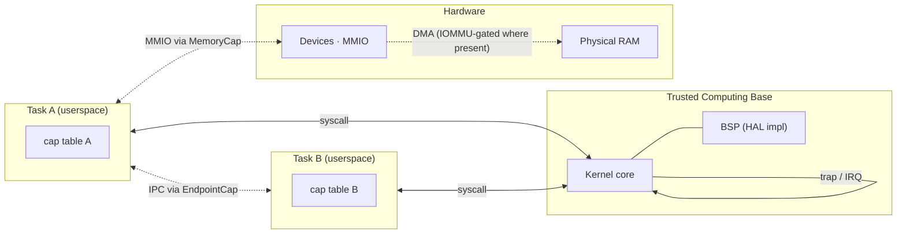
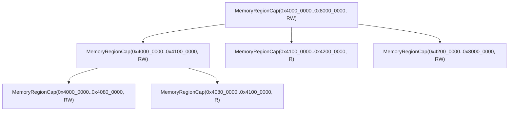

# Security model

Tyrne's security model **is** its capability system: authority is expressed as unforgeable capability tokens held in kernel-managed tables, and every privileged operation requires a specific capability. This document describes the threat model the system defends against, the trust boundaries the architecture draws, the primitives the kernel exposes to enforce access control, and — equally important — the threats that are explicitly out of scope. It is the central security document for Tyrne and is cross-referenced by the architecture overview, the HAL design, and every subsystem that touches authority.

## Context

The security model is a consequence of three prior decisions:

- [ADR-0001: Capability-based microkernel architecture](../decisions/0001-microkernel-architecture.md) — no ambient authority, capability checks on every privileged operation.
- [ADR-0002: Rust as the implementation language](../decisions/0002-implementation-language-rust.md) — memory safety enforced by the compiler for all safe code; `unsafe` audited (see [unsafe-policy.md](../standards/unsafe-policy.md)).
- [ADR-0004: Target hardware platforms and tiers](../decisions/0004-target-platforms.md) — no proprietary binary blobs in the kernel; portability across aarch64 targets without losing the security posture.

The operational expression of these decisions is collected in [architectural-principles.md](../standards/architectural-principles.md), principles **P1** (no ambient authority), **P2** (smallest defensible TCB), **P3** (drivers in userspace), **P4** (capability checks at every trust boundary), and **P7** (no proprietary blobs). This document turns those principles into a concrete security surface.

## Design

### Threat model

A threat model is the contract between what the system defends and what the system does not. Tyrne is explicit about both.

#### Adversaries we defend against

1. **Malicious or compromised userspace tasks.** A task that runs arbitrary code within its own address space must not be able to read, write, or observe state belonging to other tasks or to the kernel, except through capability-granted channels.
2. **Buggy drivers.** A driver running as a userspace task must not be able to corrupt kernel state, escalate privilege, or exceed the hardware access it was granted.
3. **Supply-chain tampering, at the dependency boundary.** Malicious code shipped inside a third-party crate must not reach the kernel without review. See [infrastructure.md — Supply-chain security](../standards/infrastructure.md).
4. **Developer error during implementation.** A large class of memory-safety bugs is made structurally impossible by Rust's type system; the remaining `unsafe` surface is audited (see [unsafe-policy.md](../standards/unsafe-policy.md)).
5. **Accidental privilege escalation** via interaction between subsystems. Capability-based authority makes it structurally difficult for code to acquire authority it was never granted.
6. **Network adversaries at task boundaries.** Once a network service exists, it must assume it is talking to an adversary. The kernel is not on the network path; the network task is a userspace compartment.
7. **Buggy or compromised bus-mastering peripherals, on platforms with an IOMMU.** A device that can issue bus-master DMA (USB host controller, network card, storage controller, DMA engine) is an independent principal on the bus, distinct from the task that drives it. On a platform with an IOMMU (SMMU on ARM), Tyrne scopes each device's DMA to only the regions its driver's `MemoryRegionCap` covers. Without an IOMMU, capability protection only constrains CPU access — the device can read or write any DRAM the bus reaches. Platforms without an IOMMU are explicitly noted under *out of scope* below; the build is documented as trusting its bus masters.

#### Assumed attacker capabilities

An attacker inside the model can:

- Execute arbitrary code in at least one userspace task.
- Issue any syscall with any arguments.
- Perform MMIO to regions they hold a `MemoryCap` for.
- Consume CPU time up to their scheduled priority.
- Observe timing of their own execution.
- Communicate with other tasks through capabilities they hold or the default system endpoints.

An attacker inside the model **cannot**, by the kernel's design:

- Forge a capability they do not hold.
- Access memory outside their address space without a capability grant.
- Invoke a privileged operation without the authorizing capability.
- Directly manipulate another task's capability table.

#### Adversaries we do not defend against

These are *out of scope* in the current model. Being explicit means that when a deployment wants one of these protections, they know an ADR and additional engineering are required.

- **Physical attackers with bus access.** Attacks using logic analyzers, cold-boot memory reads, DMA from attached devices, or fault injection are out of scope until an Tyrne deployment targets hardware with TEE / secure-element support and the project writes the ADRs that bring such support into the trust boundary.
- **Microarchitectural side channels below generic mitigations.** Spectre-family transient execution, cache timing at the line level, microarchitectural data sampling, branch-predictor sharing. Generic compile-time mitigations and kernel/userspace isolation help; dedicated side-channel-attack defences do not yet exist in Tyrne. See *Side channels* below.
- **Compromise of firmware or bootloader below the kernel's measurement.** Before measured boot is implemented (future ADR), the pre-kernel chain is trusted implicitly.
- **Compromise of the maintainer's signing key.** Trust ultimately roots somewhere; the maintainer's key is that root for releases. Key compromise is handled by rotation per [release.md](../standards/release.md), not by design within the running system.
- **Social engineering of contributors or operators.** Out of scope — human process, not system property.
- **Rowhammer and other DRAM-level attacks.** Out of scope pending targeted mitigations.
- **Denial of service through resource exhaustion at the deployment level.** A bad actor flooding a network port or saturating CPU from outside is a deployment concern (firewall, rate-limit upstream). The kernel's *internal* bounds against local resource exhaustion are a different matter and are in scope — see *Bounded kernel resources* below.
- **Peripheral DMA on boards without an IOMMU.** Raspberry Pi 4 has no SMMU: any bus-master device that the kernel has enabled can, in principle, read or write arbitrary DRAM. QEMU `virt` can be launched with SMMUv3 and is used in CI to catch driver-side misbehaviour against SMMU semantics. Jetson Orin has an SMMU and is in scope once that port lands. Until an ADR brings a no-IOMMU board into the model with explicit mitigations (physical-contract trust, driver constraint, device disablement), such boards trust their bus masters implicitly and release notes record this per target.

### Trust boundaries

A **trust boundary** is a line in the system where assumptions about integrity, confidentiality, or availability change. Tyrne recognizes the following trust boundaries; every one of them is gated by a capability check.

The boundaries, enumerated:

1. **Userspace → kernel (CPU privilege boundary).** Every syscall is the crossing point. The kernel validates the arguments, validates the bearer holds the required capabilities, then performs the operation. Failure leaks no state beyond the returned `Result`.
2. **Kernel → userspace (message delivery).** The kernel writes to a receiver's address space only through validated mappings; it never dereferences a raw userspace pointer.
3. **Task ↔ task (IPC boundary).** One task affects another only by sending a message through an `EndpointCap` both endpoints have a capability to. No shared memory by default; shared memory is an explicit capability grant.
4. **Task ↔ hardware (MMIO boundary).** A task accesses a device's registers only through a `MemoryRegionCap` whose range matches the device's MMIO region.
5. **Task ↔ interrupt (IRQ boundary).** Only the holder of an `IrqCap` for a given line can acknowledge that interrupt.
6. **Boot → kernel (pre-kernel handoff).** The kernel validates the boot information handed to it by the BSP's early-init code. Anything beyond this is in the pre-kernel trust chain, which is out of scope until measured boot is implemented.
7. **Device ↔ physical memory (DMA boundary).** A peripheral capable of bus-master DMA is a principal on the bus independent of the task that drives it. On platforms with an IOMMU (SMMU), the device's DMA authority is restricted by the kernel to regions corresponding to the driver's `MemoryRegionCap`; the same capability that gates a driver's MMIO is what the kernel uses to program the IOMMU. On platforms without an IOMMU, this boundary exists in principle but is not enforced by hardware — the build explicitly trusts its bus masters. The capability system reaches as far as the IOMMU does.

### Capabilities

A capability in Tyrne is an **unforgeable kernel-held token** that authorizes a specific operation on a specific kernel object. It is the only way authority flows in the system.

#### Why capabilities — the confused deputy problem

Capabilities are not a stylistic preference. They are the fix for a concrete class of bug that ambient-authority systems suffer structurally: the **confused deputy problem**.

Classic illustration: a compiler binary runs with elevated privilege so it can write compiled output into a privileged directory. A user invokes it: `mycompiler --output /etc/shadow src/`. The compiler has the authority (it runs elevated). The caller supplies the target. The compiler dutifully writes the output to `/etc/shadow`. It is *confused* about whose authority it is acting on — the user called it, but it acted with its own.

Every POSIX-style system has structural versions of this problem, mitigated over decades by fragile conventions (path sanitization, `chroot`, `SELinux`, capability-like `CAP_*` masks grafted onto a fundamentally ambient-authority base). Each convention is a response to a concrete failure; the failures do not stop because the root cause — *authority travels with the principal, not with the target* — is never addressed.

A capability system eliminates the confusion by construction:

- Authority does not belong to *who you are*. It belongs to *what capability you hold*.
- To write to `/var/lib/output/`, the caller must present a capability that names that region. If they pass `/etc/shadow` instead, they either hold the capability to write there (in which case the operation is legitimate) or they do not (in which case the call fails with no side effect).
- The "compiler" has no extra privilege to be confused about. It has exactly the authority the caller handed it — no more, no less.

Every design choice in Tyrne's security model descends from this: if authority always travels with the object, not with the principal, whole categories of vulnerability become structurally impossible. Path traversal into privileged directories, SUID-binary shenanigans, "service runs as root so anyone who talks to it gets root's power" — these are not bugs Tyrne patches; they are bugs the Tyrne model cannot express in the first place.

#### What a capability is, at the implementation level

- A capability is an entry in a **capability table** owned and managed by the kernel.
- A task refers to its capabilities by a **handle** — a small integer, meaningful only inside that task's table. The raw token bits are never exposed to userspace.
- Capabilities are represented in kernel code as **Rust move-only types** (neither `Copy` nor `Clone`). Duplication is a distinct operation that requires authority.
- A capability carries **rights bits** that narrow what operations its bearer can perform on the object.

#### Capability types (initial set)

The capability type inventory expands with each subsystem. The initial set, enough to bring the kernel up and expose core services to userspace:

| Type | Governs | Typical rights |
|------|---------|----------------|
| `TaskCap` | A task: lifecycle, introspection, IPC to its fault endpoint | `Control`, `Kill`, `Inspect` |
| `AddressSpaceCap` | An address space: creation, destruction, translation-table structure | `Create`, `Destroy`, `Map`, `Unmap` |
| `MemoryRegionCap` | A physical memory region, with size and alignment | `Read`, `Write`, `Execute`, `Grant` |
| `EndpointCap` | An IPC endpoint object | `Send`, `Recv`, `Grant` |
| `NotificationCap` | A one-way notification channel | `Notify`, `Wait` |
| `IrqCap` | A specific hardware IRQ line | `Claim`, `Eoi` |
| `TimerCap` | Access to the monotonic timer | `Read`, `Arm` |
| `CapTableCap` | A task's capability table (highly privileged; typically held only by the task's creator) | `Install`, `Revoke` |
| `DuplicateCap` | Authority to duplicate capabilities of a given family | `Duplicate` |
| `RevokeCap` | Authority to revoke capabilities derived from a parent | `Revoke` |

Two capability properties are load-bearing:

- **Unforgeability.** Capability tokens are entirely inside the kernel's memory. Userspace never sees raw bits; it references its own table by handle.
- **Non-transferability without consent.** A capability can be moved (via IPC) or duplicated (via a duplicate authority), but never silently copied or leaked.

#### Capability operations

The kernel exposes a small set of operations on capabilities:

- `cap_copy(src, rights_mask)` — given a capability to which the caller holds sufficient rights, install a peer in the caller's table with the same or narrower rights. Requires the source to include `Grant` or a matching authority.
- `cap_derive(src, narrower_scope)` — install a child capability with a strictly narrower scope (e.g. a sub-region of a `MemoryRegionCap`). The parent-child relationship is recorded for revocation.
- `cap_revoke(src)` — invalidate the derivation subtree rooted at `src`. The parent itself remains valid; every capability derived from it becomes unusable.
- `cap_drop(handle)` — release a capability from the caller's table. No effect on other holders.
- **Move via IPC** — send a capability as part of a message. The sender's handle is invalidated; the receiver's table gains a new handle with the same underlying capability.

#### Capability derivation tree

Derivation forms a tree. Each derived capability records its parent; each parent records its children.

Revocation of `A` invalidates `A1` and `A2` as well. Revocation of `Root` invalidates the entire tree. Derivation cannot broaden rights or expand scope; a child can only narrow what the parent had.

#### Badges

A badge is a small integer discriminator associated with a capability at derivation time (seL4 terminology). Badges let a receiver distinguish which derived capability was used to invoke it — useful when several clients share an endpoint and the service needs to know which caller arrived. The initial Tyrne plan includes 64-bit badges on endpoint capabilities; final shape decided in a future ADR.

### Authority transfer over IPC

IPC is not only data transport; it is the path by which authority moves between tasks.

- A sender may include one or more **capability handles** in a message.
- The kernel validates that the sender actually holds each named capability and that it includes `Grant` rights.
- If the receiver's capability table has sufficient space, the capabilities are installed atomically with message delivery — either the whole message and all capabilities arrive, or none do.
- The sender's handles are either consumed (for a `move`) or retained with narrower rights (for a `grant-copy`, depending on the verb used).

This is how a newly spawned task ends up with the capabilities it needs: its parent (the init task, or a supervisor) includes the initial capability bundle in the first message.

### Memory safety

Tyrne has four complementary mechanisms for memory safety:

1. **Rust type system for kernel-local memory.** Ownership, borrow checking, and move-only types enforce the invariants that C-style kernels leave to human discipline.
2. **Capability gates for cross-task memory.** No task sees another's memory without an explicit `MemoryRegionCap` grant.
3. **MMU enforcement for in-task memory.** A task's own page table prevents it from accessing regions outside what the kernel has mapped for it. Faults become traps to the kernel, which converts them to `TaskFault` messages for the supervisor.
4. **No raw userspace dereference in kernel mode.** The kernel validates an address through the task's mapping metadata before touching memory through it. A userspace pointer is treated as untrusted data.

`unsafe` appears only where the Rust type system genuinely cannot express a guarantee (MMIO, context switching, FFI to assembly stubs). Every `unsafe` block is annotated and audited per [unsafe-policy.md](../standards/unsafe-policy.md).

### Fault containment

Faults are where security models are tested. Tyrne's approach is summarized in [error-handling.md §8](../standards/error-handling.md), and restated from the security perspective here:

- **A userspace task fault** (illegal instruction, unmapped-address dereference, divide-by-zero, Rust panic propagated to `abort`) traps to the kernel. The kernel suspends the task, builds a `TaskFault` message describing the fault, and sends it on the task's supervisor endpoint. The supervisor decides policy.
- **A driver fault** is a task fault; the driver's supervisor handles it. The kernel does not crash because a UART driver panics.
- **A kernel fault** is a bug. If it occurs, the kernel panic handler logs, dumps state, and halts the machine (development) or triggers a supervised reset (production — BSP policy).
- **A hardware fault** (machine check, synchronous external abort) is routed through the HAL to a bounded, documented handler.

No kernel path turns a userspace fault into privilege escalation: the capabilities the faulting task held are dropped as part of its termination.

### Bounded kernel resources

Denial of service at the deployment level — a bad actor flooding a public port or saturating CPU from outside — is a deployment concern and is listed out of scope above. But the *kernel's own resources* must not be exhaustible by a single task. A task that can wedge the kernel has, in practice, escalated: the rest of the system stops working at its pleasure. The kernel therefore enforces two disciplines.

1. **Every kernel object has a compile-time upper bound on its size.** Capability tables, endpoint queues, notification bit-fields, task structures, TLB-shootdown batches, scheduler run-queues — each has a configured maximum built into the kernel image, with an explicit per-task or global quota. No kernel data structure grows without bound.
2. **Every allocation path returns a typed error; no allocation path panics.** When a task tries to install a capability in a full table, or send a message that would overflow an endpoint's queue, the syscall returns a specific error (`CapsExhausted`, `QueueFull`, `OutOfFrames`, `TasksExhausted`). The task handles it. The kernel survives. Panic on resource exhaustion would be a bug.

Concrete bounds — specific values fixed per board in the BSP, not per kernel build in general:

| Resource | Bound | Failure mode |
|----------|-------|--------------|
| Capability table entries per task | configured at task creation | `cap_copy` / IPC receive returns `CapsExhausted` |
| Endpoint send-wait queue length | per-endpoint quota | `send` returns `QueueFull` in non-blocking mode; blocks in blocking mode |
| Notification bit-field | 64 bits | saturate-on-set; `notify` cannot fail from overflow |
| Pending-IPC fast-path slots | per-CPU bound | fall back to full rendezvous path |
| Task count | global | `task_create` returns `TasksExhausted` |
| Physical frame allocator | total RAM | `frame_alloc` returns `OutOfFrames` |
| Scheduler run-queue depth | per-priority | enqueue fails at creation, not at steady state |

A deliberately malicious task cannot turn "my allocation failed" into "the kernel crashed." The security model promises this. The scheduler, quota system, and the [error-handling standard](../standards/error-handling.md) enforce it together.

### Side channels

Side-channel attacks exploit information leakage through mechanisms the functional correctness of the system does not mention — cache timing, branch prediction, speculation, shared microarchitecture. Tyrne's current posture:

- **Architectural isolation.** Process isolation (separate address spaces, separate capability tables) is the first-line defense. It does not help against shared-microarchitecture attacks.
- **Kernel isolation on affected CPUs.** Where the CPU requires it (Meltdown-class vulnerabilities), a kernel page-table isolation design is planned — documented as an open question and resolved per CPU in the BSP.
- **Compile-time mitigations.** `spectre_v2` mitigations via compiler flags where the Rust toolchain provides them.
- **Timing-sensitive cryptography.** When Tyrne eventually has cryptographic primitives, they will use constant-time implementations and avoid secret-dependent branches.
- **Gaps honestly documented.** Full Spectre-class mitigation is a CPU-dependent, evolving area. Tyrne commits to documenting which CPUs are considered mitigated, on what generations of kernel, with what residual risk.

### Cryptography

The kernel has **no cryptographic primitives** in its initial form. This is deliberate: every primitive is a potential correctness and side-channel surface. When cryptography is introduced:

- An ADR per primitive or primitive family.
- No roll-your-own. Only well-known algorithms from audited crates.
- A [security-review](../standards/security-review.md) pass on every introduction, separately from code review.
- Keys are first-class types that do not implement unredacted `Debug` or `Display`. See [logging-and-observability.md](../standards/logging-and-observability.md).

### Supply chain

The code the kernel runs is only as trustworthy as the sources it came from. Tyrne's supply-chain defences live primarily in [infrastructure.md](../standards/infrastructure.md):

- Pinned nightly Rust toolchain in `rust-toolchain.toml`.
- Every dependency passes a `cargo-vet` certification.
- Every dependency passes `cargo-audit` against the RustSec advisory DB.
- Reproducible builds are an explicit goal.
- SBOM generation per release.
- Signed release artifacts.
- Dependency additions follow the [add-dependency skill](../../.claude/skills/add-dependency/SKILL.md).

### Boot integrity (future)

Measured boot, secure boot, and attestation are not in the initial scope. The boot chain is:

1. Board firmware (ROM / first-stage bootloader) — trusted implicitly.
2. BSP early-init — trusted; part of the kernel build.
3. Kernel main — the beginning of explicit trust enforcement.

Future ADRs will bring the boot chain into the trust model as deployments with appropriate hardware support come online. Until then, the security model starts at `kernel_main`.

## Invariants

These are the load-bearing properties of the security model. Every implementation and every review confirms them.

- **No privileged operation occurs without the authorizing capability.** Absent capability → deny. No exceptions.
- **No ambient authority.** There is no "root" or "admin" principal that bypasses capability checks. The only authority is held capabilities.
- **Capabilities are unforgeable.** Userspace never sees raw capability bits; it references its own table by handle.
- **Capabilities move with consent.** No capability leaves a table without an operation the table's owner initiated.
- **Capability rights narrow, never broaden, on derivation.** A derived capability cannot grant more than its parent.
- **Revocation is transitive over a derivation subtree within a single capability table.** Revoking a parent invalidates all derived children atomically.
  - *v1 scope limitation.* IPC transfer installs the received capability as a new root in the receiver's table — the `ipc_recv` path calls `insert_root`, discarding the cross-table parent-child link.
  - *Consequence.* `cap_revoke` traverses only within a single table, so a sender's revoke does not reach copies that have been moved over IPC.
  - *Workarounds for a sender that needs to retain revoke authority over an IPC-transferred right.* Either (a) refuse to transfer the derived cap and instead transfer a distinct derived child kept locally, or (b) accept that the receiver now holds an independent root.
  - *Cross-table revocation* (a cross-task capability derivation tree) is an open question tracked below.
  - Recorded by the [security review of Phase A exit](../analysis/reviews/security-reviews/2026-04-21-tyrne-to-phase-a.md).
- **A sender cannot transfer authority it does not hold.** The kernel validates every claimed capability at send time.
- **The kernel never dereferences raw userspace pointers.** Access goes through validated mappings.
- **Drivers are userspace tasks.** No driver code executes in privileged mode.
- **`unsafe` is audited.** Every `unsafe` block in the tree has a `SAFETY:` comment, an audit-log entry, and a security reviewer sign-off per [unsafe-policy.md](../standards/unsafe-policy.md).
- **No proprietary binary blobs in the kernel.** Every byte linked into the privileged image is either project source or an audited open-source dependency.
- **Fault containment does not leak authority.** A task's capabilities are dropped when it is terminated; the supervisor receives only the fault descriptor, not the capabilities.
- **Bounded kernel state.** Every kernel data structure has a compile-time maximum size; no kernel path allocates without bound. Resource exhaustion surfaces as a typed error to the caller, never as a kernel panic, stall, or unbounded memory growth.
- **DMA is capability-scoped where the hardware permits.** On platforms with an IOMMU (SMMU), peripheral DMA is gated by the same capability that grants a driver its MMIO region. On platforms without an IOMMU, the build is explicitly documented as trusting its bus masters, and release notes record this per target.

## Trade-offs

Every security property above has a cost. The costs are acceptable because the properties are; they are listed here so future contributors can weigh them on the margin.

- **Cognitive overhead of capability reasoning.** Every feature design begins with "what capabilities does this need?" rather than "who calls this?". Onboarding tax; amortized by docs and skills.
- **IPC cost at every trust boundary.** Every cross-task operation crosses an address-space boundary. Fast-path IPC design must earn the overhead back on the critical path.
- **Revocation tree bookkeeping.** Parent-child links inside the capability table cost memory and a small amount of kernel work per derivation. Bounded by the per-task capability budget.
- **No ambient authority means no convenience.** You cannot "just run as admin to get something done"; you must hold the capability. This is good for security, annoying for quick debugging. Debug capabilities (gated by build config) partially mitigate.
- **Side-channel mitigations are incomplete.** Tyrne is not a constant-time kernel as a whole; full Spectre-family mitigations are CPU-dependent and evolving. We document rather than promise.
- **Capability transfer cost.** Moving capabilities with messages costs kernel time per transfer. Applications that move many capabilities repeatedly will notice.

## Open questions

Each of these is a future ADR.

- Final badge scheme: 64 bits per endpoint is the tentative answer; precise semantics of badge inheritance through derivation unclear.
- Capability derivation depth limit: bounded (with what bound?) or unbounded with explicit per-task budget?
- Revocation semantics under concurrent use: a capability being actively used on one CPU while being revoked on another — kernel must serialize or gate correctly; design needs to be pinned.
- Kernel page-table isolation policy per CPU generation: when is KPTI on, when is it unnecessary?
- Secure storage for capabilities that must persist across reboot (e.g. device identity): design open.
- First cryptographic primitives: hash function, signature scheme, AEAD — per-primitive ADR when the need arises.
- Measured / secure boot design for Tier 2 hardware (Pi 4, Pi 5) and Tier 3 (Jetson).
- Resource-exhaustion DoS policy within the scheduler (quotas, priority inheritance, deadline inheritance).
- **IOMMU / SMMU policy per target.** Raspberry Pi 4 has no SMMU — do we accept implicit trust of all enabled bus masters, refuse to enable DMA-capable devices and force PIO, or gate DMA-capable devices behind a deployment-time opt-in? QEMU `virt` has SMMUv3 and should be the CI gate that catches driver regressions against IOMMU expectations. Jetson Orin has an SMMU and adopts the same model when its port lands. ADR required before the first driver that enables bus-master DMA.
- **Concrete bounds** for the quotas under *Bounded kernel resources*: numeric defaults for each, per-target tuning policy, and how upgrades change them without invalidating running systems.
- **Cross-table capability derivation tree (CDT).** Whether IPC-transferred capabilities should retain a parent-child link to the sender's entry so that the sender can revoke the copy post-transfer, and — if so — how per-task-table CDT storage scales. seL4's answer is a whole-system CDT; Phase B needs to decide before the first multi-task system uses transfer as a revoke-retained grant. See the v1 qualification on *Revocation is transitive* above.
- **Early IRQ masking in BSP reset vectors.** v1's `boot.s` on QEMU `virt` does not explicitly `msr daifset, #0xf` before stack / BSS setup — the reset state happens to leave interrupts effectively masked (no IRQ source is configured and the GIC is untouched), but this is a per-platform accident rather than a guarantee. Future BSPs should adopt "mask DAIF first, everything else after" as a standard reset-vector prologue; add the instruction to the [BSP boot checklist](../standards/bsp-boot-checklist.md) and audit the existing checklist at that time.

## References

- [ADR-0001](../decisions/0001-microkernel-architecture.md) — the capability-based microkernel choice.
- [ADR-0002](../decisions/0002-implementation-language-rust.md) — Rust as the basis for memory safety.
- [ADR-0004](../decisions/0004-target-platforms.md) — no-blob posture.
- [Architectural principles P1–P4, P7](../standards/architectural-principles.md).
- [unsafe-policy.md](../standards/unsafe-policy.md) — the discipline at the Rust safety boundary.
- [security-review.md](../standards/security-review.md) — the review pass for security-sensitive changes.
- [error-handling.md](../standards/error-handling.md) §8 — fault containment policy.
- [infrastructure.md](../standards/infrastructure.md) — supply-chain defences.
- [overview.md](overview.md) — the architectural context this document elaborates.
- Klein, G., et al. *"seL4: Formal Verification of an OS Kernel."* SOSP 2009.
- Shapiro, J., Smith, J., Farber, D. *"EROS: A Fast Capability System."* SOSP 1999.
- Hardy, N. *"KeyKOS: A Secure, High-Performance Environment for S/370."* 1985.
- Miller, M. *"Robust Composition: Towards a Unified Approach to Access Control and Concurrency Control."* PhD thesis, 2006.
- NIST SP 800-30 Rev. 1 — *Guide for Conducting Risk Assessments*.
- ARM *Reference Manual* — privilege levels, exception model, page-table architecture.
