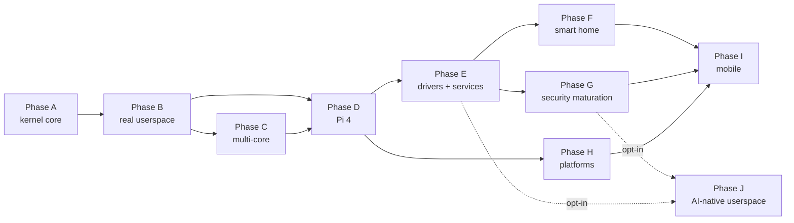

# Phase plan

Ten phases, rough execution order. Each phase is a separate file so detail can grow without any single document becoming unnavigable.

The plan is a **sequence**, not a schedule: there are no dates. Later phases are sketched at lower resolution than earlier ones; detail appears as its turn approaches. The *why* behind the whole system lives in [ADR-0013](../../decisions/0013-roadmap-and-planning.md).

## Phase index

| Phase | Title | Detail level | Exit bar |
|-------|-------|--------------|----------|
| [A](phase-a.md) | Kernel core on QEMU `virt` | Detailed | Two kernel tasks exchange IPC messages under capability control on QEMU. |
| [B](phase-b.md) | Real userspace | Detailed | A userspace task runs in its own address space and makes syscalls. |
| [C](phase-c.md) | Multi-core | Detailed | Preemptive scheduler across two or more cores with working cross-core IPC. |
| [D](phase-d.md) | Raspberry Pi 4 (first real hardware) | Detailed | `bsp-pi4` boots on a real Pi 4 at feature parity with QEMU virt. |
| [E](phase-e.md) | Driver model and essential services | Medium | Userspace drivers + log + storage + filesystem + network services composed. |
| [F](phase-f.md) | Smart-home deployment | Medium | A real Tyrne-firmware device running in the maintainer's smart home. |
| [G](phase-g.md) | Security maturation | Medium | Measured boot, cryptography primitives, TLS, first formal-verification pilot. |
| [H](phase-h.md) | Platform expansion | Light | `bsp-pi5`, `bsp-jetson` (CPU-only), first RISC-V BSP. |
| [I](phase-i.md) | Mobile | Light | First prototype boot on phone-class hardware. |
| [J](phase-j.md) | AI-native userspace layer (opt-in) | Sketch | Optional AI-integrated features running entirely in userspace above the kernel's trust boundary. Per [ADR-0015](../../decisions/0015-ai-integration-stance.md). |

## Dependency sketch

Phases C and D may overlap: Pi 4 bring-up does not strictly require multi-core, but multi-core is easier to design and test against real hardware.

## Why split by file

A single `phases.md` with full detail for nine phases would run well over a thousand lines. Splitting lets:

- Each phase accumulate detail as its turn approaches without bloating the others.
- Diffs that touch one phase not noise-pollute PRs that touch another.
- The plan index stay one page long.

Detail grows as the phase approaches its turn: Phase A carries the most detail (it is active); Phase I is a sketch.

## Living-document note

Commits that touch phase files describe what changed — a milestone added, a task reordered, a sub-breakdown expanded — with a brief rationale. Structural changes (adding or dropping a phase) require an ADR per [ADR-0013](../../decisions/0013-roadmap-and-planning.md).
