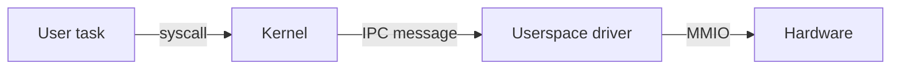

# Documentation style

This standard defines how documentation files are written in the Tyrne repository. It applies to every file under `docs/**`, to the top-level `README.md`, `CLAUDE.md`, `AGENTS.md`, `SECURITY.md`, `CONTRIBUTING.md`, `NOTICE`, and to `.md` files introduced elsewhere in the tree.

If a rule here would produce an unreadable result in a specific case, prefer clarity over the rule and note the exception in a review comment.

## Language

- **English only.** See [ADR-0005](../decisions/0005-documentation-language-english.md). No Turkish (or other non-English) in committed markdown, ever — not even in quoted examples. If you need to show a non-English string, show it as data (e.g., in a code block) and describe its meaning in English prose.

## Structure of a document

1. **Title** as a single `#` heading, matching the filename's intent.
2. **One-paragraph summary** directly under the title. A reader who skims only this paragraph should be able to say what the document covers and who it is for.
3. **Section headings** (`##`, `###`) for navigation. Use as many as the document needs, but do not use `####` unless nesting is genuinely required.
4. **References / further reading** at the bottom if the document draws on external material.

ADRs follow the MADR structure in [`../decisions/template.md`](../decisions/template.md). Do not invent an alternative ADR format.

## Tone and depth

- Prefer **depth over brevity** when a topic is subtle. Explain the reasoning, not just the outcome. Give the trade-offs that were considered, not only the one that won.
- Write for a reader who is *technical but new to Tyrne*. Assume general operating-systems literacy (kernel, process, interrupt, page table) but not Tyrne-specific vocabulary (use the glossary).
- Prefer concrete examples over abstract descriptions. When explaining a design, show the shape of a function signature or a capability graph.
- Avoid marketing adjectives ("robust", "seamless", "elegant", "powerful") — they add no information. Describe behavior, not impression.
- Use the active voice. "The kernel transfers the capability" over "The capability is transferred by the kernel."

## Diagrams

- **Mermaid only.** Every diagram is an inline fenced code block with the `mermaid` language tag. No PNG, SVG, ASCII-art, or other binary / external formats.
- Diagrams earn their place when they communicate something the surrounding prose cannot: boundaries, flows, state machines, component relationships. Decorative diagrams are not added.
- Every diagram must be preceded by a short prose description explaining what the diagram shows. Readers with screen readers depend on this.
- Keep diagrams small. If a diagram needs more than ~15 nodes, split it.

Example:

## Code blocks

- Fenced with backticks, with a language tag (`rust`, `c`, `sh`, `text`, `mermaid`, etc.). Never use an untagged fence.
- Use `rust` for both illustrative pseudocode and real code; disambiguate in prose if necessary ("*conceptual, not real code*").
- Command lines use `sh` and show the prompt only when it matters for context. No fake prompts like `$ `.

## Links

- **Relative** within the repository (e.g., `../decisions/0001-microkernel-architecture.md`).
- **Absolute** for external resources. Prefer permalinks (e.g., GitHub permalinks, archived versions) for citations that matter.
- Do not use bare URLs as link text. Use descriptive link text: `[seL4 paper (Klein et al. 2009)](https://...)`.

## Tables

- Use when the content has two or more dimensions (rows × columns of attributes).
- Do not use tables for layout of two-sentence paragraphs. Prose is better there.
- Keep tables to a width that renders on GitHub without horizontal scrolling (~120 characters is a practical ceiling).

## Line length and wrapping

- No hard line length. Markdown renders regardless.
- A useful convention: **one sentence per line** in prose paragraphs. It produces cleaner diffs and easier cross-ADR grep-ability than word-wrapping at 80 characters.

## File naming

- `kebab-case.md` for all documents.
- ADRs are `NNNN-short-slug.md` where `NNNN` is a zero-padded four-digit sequence number.
- `README.md` is reserved for folder index files; do not put substantive content directly in a `README.md` beyond orientation and linking.

## Cross-referencing

- When a document makes a claim that rests on a decision, link to the ADR that recorded the decision.
- When a glossary term is first used in a document, link it to the glossary entry: `[capability](../glossary.md)`.
- When two documents cover related material, cross-link both directions.

## Change policy

- Editing an existing document: make the change, update any affected cross-links, and if the change reverses a prior claim, note that it does so.
- Replacing a document: delete the old file in the same commit that introduces the new one.
- Deprecating a document: leave it in place, add a `> **Deprecated.** See [new-doc.md](new-doc.md) for the current guidance.` note at the top, and set its links to point at the replacement.
- ADRs are append-only. To reverse a decision, write a new ADR that supersedes the old one; do not rewrite history.

## What not to put in documentation

- Secrets or credentials.
- Contributor personal identifiers beyond GitHub handles.
- Internal chat logs (these may be in a non-English language per [ADR-0005](../decisions/0005-documentation-language-english.md)).
- Auto-generated content without a note indicating how it was generated and where the generator lives.
